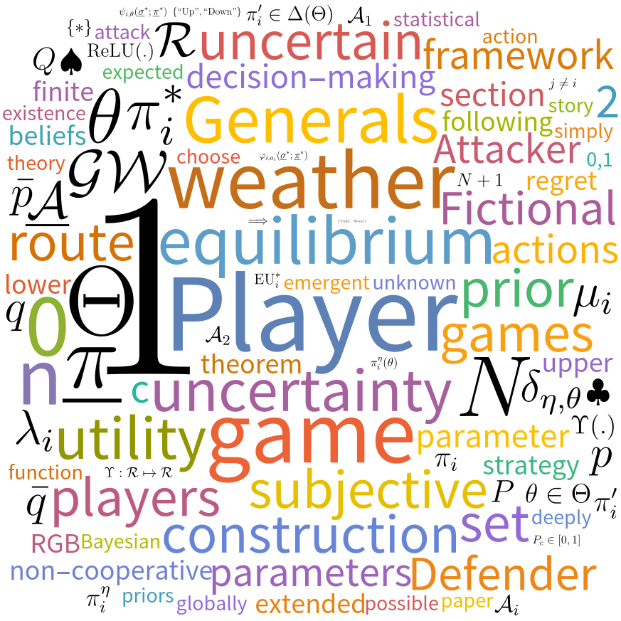

# Non-Cooperative Games with Uncertainty

This repository accompanies a paper on **Extended Equilibrium** and collects all the resources, software, talks, and further content related to the work.
See the related arXiv paper:

[**arXiv:2503.01889**](https://arxiv.org/abs/2503.01889)
(or a local copy of the paper on [Extended Equilibrium](https://github.com/Konczer/UncertaintyTheory/raw/refs/heads/main/ExtendedEqilibrium/arXiv/pdf/2503.01889v1.pdf))


>  **Abstract:** This paper introduces a framework for finite non-cooperative games where each player faces a globally uncertain parameter with no common prior. Every player chooses both a mixed strategy and projects an emergent subjective prior to the uncertain parameters. We define an "Extended Equilibrium" by requiring that no player can improve her expected utility via a unilateral change of strategy, and the emergent subjective priors are such that they maximize the expected regret of the players. A fixed-point argument -- based on Brouwer's fixed point theorem and mimicking the construction of Nash -- ensures existence. Additionally, the "No Fictional Faith" theorem shows that any subjective equilibrium prior must stay non-concentrated if the parameter truly matters to a player. This approach provides a framework that unifies regret-based statistical decision theory and game theory, yielding a tool for handling strategic decision-making in the presence of deeply uncertain parameters.

## Illustrating fictional story

**The story of two generals and the weather**
(A slightly modified version of the [Illustrating Example](https://arxiv.org/pdf/2503.01889#section.2) from the paper):

Imagine two generals, a "Defender" (Li, 李) and an "Attacker" (Gar, མགར). To embed the story into a semi-historical context, one can picture the dilemmas of the generals and emperors from the Tang-Tibetan Wars in the 7th century. (The Himalayas or other mountains of Central Asia and the Tibetan Plateau could provide the mountain scene.)
Li and Gar are preparing for battle near a mountainous region more than a thousand years ago – in an era when technology for reliable weather forecasting was not accessible.

The possible battlegrounds are new for both generals, but scouts identified two directions for the attack – an upper route in the hills and a lower route in a valley.
In the hills, the ever-changing weather also plays a crucial role. By a sudden storm, it can wipe out a whole attacking army.

Both generals can choose from two actions. Li can decide to defend the upper or the lower route, while Gar can decide to attack from the same two directions. The next day, the weather can be in two states; there can be a storm in the hills, or the weather can stay calm.

The winning and losing prospects depend on the actions of the generals and on the weather in the following way:
If the weather is calm, then Li loses if he is attacked from an undefended direction, but the defense is always successful if both generals choose the same direction.
In case of a storm, however, the attacking army would be lost if it dared the upper route. (On the lower route, in the valley, the weather does not change the outcome of a battle.)

Assuming that no general has reliable knowledge about the weather or can reliably associate a probability distribution to it – and their lack of information is common knowledge – what strategy should the generals follow?
(The generals are capable of randomization – methods such as divinations of various kinds were used from prehistory to make randomized actions.)

## Related links and resources

- You can discuss and comment on the paper on [alphaXiv](https://www.alphaxiv.org/):
    - [alphaxiv.org/abs/2503.01889](https://www.alphaxiv.org/abs/2503.01889)
    - See its suprisingly accurate and clear AI generated [Overview](https://www.alphaxiv.org/overview/2503.01889) on alphaXiv.

- Talks:
    - To Be Announced

 - Software:
    - [UncertaintyGameSolve](https://github.com/Konczer/UncertaintyTheory/tree/main/ExtendedEqilibrium/Software/WL) a Wolfram Language (Mathematica) implementation to compute the Extended Equilibrium for minimal $|\mathcal{A}_1|=2$, $|\mathcal{A}_2|=2$, $|\Theta|=2$ games with uncertainty.

- [LaTeX source](https://github.com/Konczer/UncertaintyTheory/tree/main/ExtendedEqilibrium/arXiv/LaTeX) and [local copy](https://github.com/Konczer/UncertaintyTheory/tree/main/ExtendedEqilibrium/arXiv/pdf) of the manuscript.

- Posts:
    - See a social media post on [LinkedIn](https://www.linkedin.com/posts/j%C3%B3zsef-konczer-25290189_dear-friends-and-colleagues-i-am-happy-activity-7303151286323965952-kQne) for a broader context.

- Broader project:
    - Non-Cooperative Games with Uncertainty and the introduced Extended Equilibrium is part of a broader project which aims to formalize the concept of *uncertainty* in the context of Game Theory. Resources for this more general project can be found in the [Uncertainty Theory](https://github.com/Konczer/UncertaintyTheory/tree/main) parent repository.


## Citation

To cite the *Non-Cooperative Games with Uncertainty* paper, you can use the following BibTeX entry:

```latex
@misc{ExtandedEquilibriumKonczer2025,
      title={Non-Cooperative Games with Uncertainty}, 
      author={Jozsef Konczer},
      year={2025},
      eprint={2503.01889},
      archivePrefix={arXiv},
      primaryClass={econ.TH},
      url={https://arxiv.org/abs/2503.01889}, 
}
```