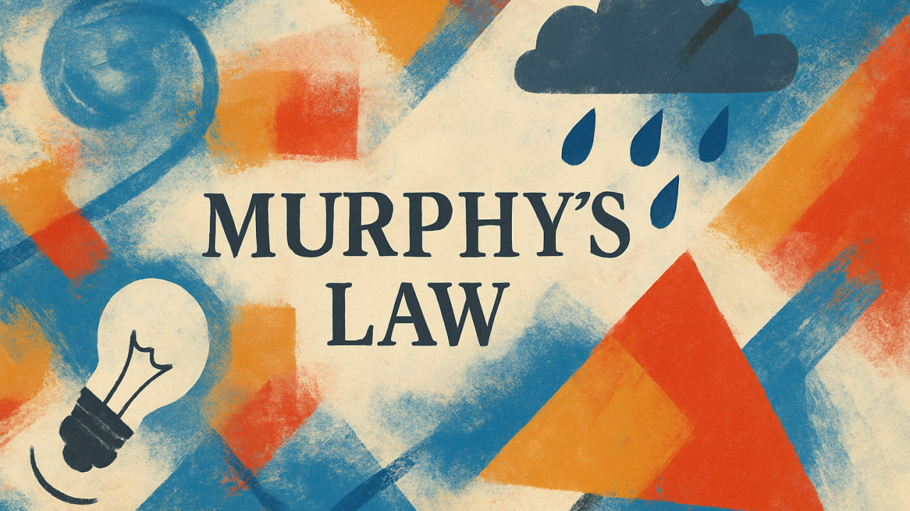
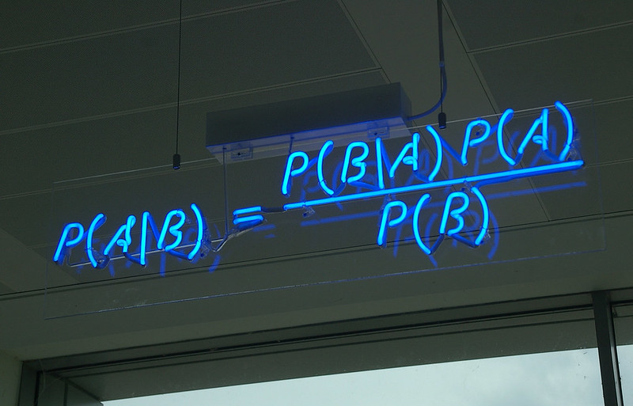

# Statistical Games, a condensed AI summary

*This summary was created with the help of [Claude](https://claude.ai/) Opus 4.5 (developed by [Anthropic](https://www.anthropic.com/)) on 20 January 2026, based on the original documents: [Statistical Games, an informal summary](https://github.com/Konczer/UncertaintyTheory/blob/main/StatisticalGames/Blog/README.md) blogpost and the [Statistical Games](https://arxiv.org/abs/2402.15892) paper. The summary has been carefully read and verified by the original author of the paper and blog post – who has written these lines as well –, [József Konczer](https://konczer.github.io/).*

## Context

This is a condensed AI-generated summary of an informal introduction to [Statistical Games](https://arxiv.org/abs/2402.15892), a research program that proposes grounding statistical and probabilistic concepts in Game Theory. For those who appreciate mathematical formalisation, properly stated theorems and proofs, the full paper is available at [arXiv:2402.15892](https://arxiv.org/abs/2402.15892), along with the project's [GitHub page](https://github.com/Konczer/UncertaintyTheory/tree/main/StatisticalGames).

This summary aims to serve both as an engaging high-level overview and as a companion hook for the original 129-page manuscript. Even if abstract formulas are not your cup of tea, the core ideas can be appreciated without delving into mathematical details.

## Introduction

A practically unavoidable task for every organism is to act based on partial information. Humans, animals, and machines all need to navigate environments where they can't see the full picture.

Although the incomprehensible complexity of the whole world prevents us from reaching absolute certainty, we can construct models, gather data, and develop heuristics to ride "better" the waves of reality. One refined approach is decision-making aided by statistics and probability theory. However, the most well-known interpretations and frameworks for Probability theory and theoretical Statistics seem to focus more on making rigorous statements (often only in various limiting cases) than guiding an Agent with only a finite amount of data.

The author's aim was to construct a broader framework in which Statistics and Probability theory are not separate disciplines operating with their own concepts, but are ingredients in an integrated decision-making process for an Agent that needs to take actions with incomplete information. After necessary mathematical idealisations, the best framework to analyse this decision-making process appears to be Game Theory.

## Why Game Theory?

*Image source: *[Introduction to Game Theory](https://nordstrommath.com/IntroGameTheoryv4-2020.pdf) a Discovery Approach* by Jennifer Firkins Nordstrom*

Game Theory is concisely defined as *the study of strategically interdependent behaviour*. One can first think of rock-paper-scissors, board games, or any leisure game with fixed rules—but the formalism is far more widely applicable, addressing problems in biology, politics, economics, military theory, and artificial intelligence.

Game Theory formally describes Games in which "rational" players act and receive payoffs based on their collective actions. The standard assumptions include: a finite number of Players, finite Action sets, outcomes depending on all Players' choices, no external communication, the ability to randomise strategies, and Players aiming to maximise their Expected Utility—where *Utility* is the Players' subjective quantity associated with the "desirability" of possible consequences.

### Common Misconceptions

It is NOT the case that Game Theory assumes selfish players. Utility functions can incorporate altruistic preferences—swapping two players' payoff functions creates a valid Game where both players care only about the other's welfare.

It is NOT the case that Game Theory promotes zero-sum thinking. The framework handles both competitive and cooperative behaviour; in fact, Mechanism Design can be viewed as the art of designing rules and incentive structures to create cooperative behaviour.

It is NOT the case that Game Theory is grounded in Utilitarianism. Utility functions are subjective and personal—adding different Players' utilities together does not make sense within the framework.

Game Theory is flexible enough to provide a valuable model-making tool for a wide variety of "strategically interdependent behaviours." Still, the author suggests against relying on one's life decisions and moral outlook solely on it.

### The Prototypical Example: Matching Pennies

The Native American Hand Game—with prehistoric roots—illustrates the core intuition. This trickster game is played by the *Guessing* player (Player 1) and the *Hiding* player (Player 2). The Hiding player conceals a striped bone in one hand while putting a plain bone in the other. The Guessing player must identify which hand holds the striped bone.

  

  <em>
    Hand Game Bone sticks (image from 
    <a href="https://americanindian.si.edu/collections-search/object/NMAI_20228" target=_blank>National Museum of the American Indian</a>).
  </em>

Without any formal reasoning, it is clear that the best strategy for the Hiding player is to choose randomly without bias—this is how she confuses the Guessing player most and protects herself from exploitation. The same applies to the Guessing player.

This simple game captures an essential insight: the rules are totally deterministic, yet there are no deterministic pure solutions. If there were a computable function governing one player's action, the other could predict and exploit it. The equilibrium requires randomised (mixed) strategies, and this need for randomisation can serve as a foundation for probability itself.

## Decision-Making Under Uncertainty

By uncertainty the author means "known possibilities with unknown probabilities"—variables that can take values, but for which we cannot assign credible probability distributions. Following Frank Knight's seminal distinction, this differs from Risk, where probabilities are known.

The Game-theoretic framework for decision-making suggests imagining an adversarial "Trickster" player behind the veil of uncertainty. This is a formalisation of Murphy's Law: "If anything can go wrong, it will... and at the worst possible time, in the worst possible way."

  

  <em>
    "If you don’t plan for failure, the universe will show you exactly where you didn’t."
    Murphy's Law interpreted by
    <a href="https://www.linkedin.com/pulse/murphys-law-what-did-murphy-say-he-pragmatist-john-willis-rqcue"
    target=_blank>John Willis</a>.
  </em>

Two crucial clarifications prevent this from being overly pessimistic:

First, the framework assumes we can protect ourselves through unpredictability. Even if we suspect rain when we don't carry an umbrella and clear skies when we do, randomising our choice offers some protection. The Trickster is not projected to have mind-reading abilities—only the aim of being our adversary.

Second, the Trickster cares about our *regret*—the difference between the best possible action in hindsight and what we actually chose—not our total loss. This important modification (made by L. J. Savage) introduces a built-in "fear of missing out" mechanism. It "motivates" the Trickster to offer states containing opportunities, because always offering the worst case would cause us no regret. This seemingly small change introduces hope and induces an explorative, adaptive mindset—turning pessimism into pragmatism.

  

  <em>
    Ghost figurines symbolising the regret-maximising “Trickster”. Original image source:
    <a href="https://www.yorkghostmerchants.com/original-york-ghost/project-one-z2fga-7yhl2-njr7m-6j5fm-74j42-t7w6n" target="_blank">Dusty Purple Ghost</a>
    by York Ghost Merchants.
  </em>

## Statistical Games: The Core Construction

The paper poses a problem entirely within traditional Game Theory: Two players play a choosing-guessing game—what are their optimal strategies? This cautious approach allows investigating behaviour within a well-established framework while yielding rigorous, standalone formal statements.

  

  <em>
    <a href="https://arxiv.org/pdf/2402.15892#figure.caption.28" target="_blank">Figure 6</a>: 
    Strategy plot for the symmetric equilibrium of Game(N=4, KA=4, KB=6, M=10). 
    This highly symmetric game produces an intricate fractal-like pattern. Rectangle areas represent 
    outcome probabilities; orange indicates Player 1 wins, blue indicates Player 1 loses.
  </em>

### Fisher Games

The paper provides a formal definition ([Definition 2.1](https://arxiv.org/pdf/2402.15892#definition.2.1)): In a Fisher game, Player 2 chooses between scenario A or B and produces a binary sequence of length M containing precisely $`K_A`$ or $`K_B`$ ones respectively. Player 1 (not knowing Player 2's actions) samples N bits from this sequence and, after observing their values, guesses which scenario was chosen. If correct, Player 1 wins.

The simplest case (N=0) reduces to Matching Pennies—blind guessing with 50-50 equilibrium. This corresponds to the [statistically trivial case](https://arxiv.org/pdf/2402.15892#subsubsection.2.1.1) discussed in the paper. The smallest *nontrivial* case involves sampling one bit from a two-bit sequence, where scenario A contains only 0s and scenario B contains one 1 and one 0.

Here, statistical reasoning begins to emerge. Scenario A is easier to identify because it contains only 0s—if Player 1 samples a 1, she knows scenario B was chosen. But if she samples a 0, she cannot be sure. This asymmetry makes scenario A less attractive to choose, yet Player 2 cannot abandon it entirely without being exploited.

The general equilibrium solution involves three parameters:
- P* ∈ (0,1): probability of Player 2 choosing scenario A
- k* ∈ {0,...,N}: critical threshold for the number of 1s observed
- ν* ∈ [0,1): probability of guessing A when exactly k* ones are observed

The general symmetric solution is presented in [Theorem 2.1](https://arxiv.org/pdf/2402.15892#theorem.2.1) and proven in [Appendix A](https://arxiv.org/pdf/2402.15892#appendix.A).

<table>
  <tr>
    <td align="center" width="50%">
       
      <em>
      <a href="https://arxiv.org/pdf/2402.15892#figure.caption.27" target="_blank">Figure 5a</a>:
      Game(N=2, KA=2, KB=4, M=7)</em>
    </td>
    <td align="center" width="50%">
       
      <em>
      <a href="https://arxiv.org/pdf/2402.15892#figure.caption.27" target="_blank">Figure 5b</a>:
      Game(N=3, KA=2, KB=4, M=8)</em>
    </td>
  </tr>
</table>

  <em>
    Equilibrium strategy plots for Fisher games. Each rectangle represents a possible outcome under equilibrium play: Player 2's sequence choice (columns) versus Player 1's sampling and guessing strategy (rows). Rectangle areas are proportional to outcome probabilities. Orange, ■ indicates Player 1 wins; blue, ■ indicates Player 1 loses. The intricate patterns emerge from the interplay of randomised strategies.
  </em>

  <em>
    Equilibrium strategy plots for Fisher games. Each rectangle represents a possible outcome under equilibrium play: Player 2's sequence choice (columns) versus Player 1's sampling and guessing strategy (rows). Rectangle areas are proportional to outcome probabilities. $\textcolor{#E7A046}{\blacksquare}$ indicates Player 1 wins; $\textcolor{#25548A}{\blacksquare}$ indicates Player 1 loses. The intricate patterns emerge from the interplay of randomised strategies.
  </em>

  <em>
    Equilibrium strategy plots for Fisher games. Each rectangle represents a possible outcome under equilibrium play: Player 2's sequence choice (columns) versus Player 1's sampling and guessing strategy (rows). Rectangle areas are proportional to outcome probabilities. $`\textcolor{#E7A046}{\blacksquare}`$ indicates Player 1 wins; $`\textcolor{#25548A}{\blacksquare}`$ indicates Player 1 loses. The intricate patterns emerge from the interplay of randomised strategies.
  </em>

The strategy plots above show equilibrium solutions for larger Fisher games, displaying intricate fractal-like patterns where areas represent outcome probabilities under equilibrium play.

### Emerged Statistical Concepts

Remarkably, by simply searching for optimal strategies, basic statistical concepts emerge without being imposed:

**Sufficient statistics**: Player 1 was allowed to incorporate any collected data—including positions and order of observed bits. Yet the equilibrium shows she can make optimal decisions using only the total count of 1s. This is exactly the concept of sufficiency in statistics: an aggregated summary sufficient for decisions.

**Type I and Type II errors**: The equilibrium strategy represents a statistical test whose total error probability (Type I + Type II) is independent of the prior occurrence of scenarios—"independent of the probability law a priori."

**Randomised sampling**: The mutual randomisation of sampling and sequence selection emerges naturally, giving clear intuition for why we should select samples unpredictably and unbiasedly—a central concept present from the early days of statistics.

**Emergence of probability distributions**: The game definition is entirely deterministic. Yet probabilistic concepts prove useful and emerge naturally through equilibrium strategies, interpretable "as the outcome of a random device, even though this is not the case."

**Randomised acts**: Unlike traditional statistics, the framework sometimes requires randomising our actual decisions. This suggests that decision-making under deep uncertainty is more of an art related to actions than a purely scientific endeavour immersed in thought.

For further details, see [Section 2.6](https://arxiv.org/pdf/2402.15892#subsection.2.6) in the paper.

## Bayesian Games

Now imagine a different casino where instead of betting on A or B outright, we allocate portions of our capital to each outcome. The portion placed on the winning scenario doubles; the rest is lost.

  

  <em>
 Image source:
    <a href="https://www.montecarlosbm.com/en/casino-monaco/games/roulette-anglaise" target="_blank">Casino de Monte-Carlo</a>.
  </em>

Consider: if outcome A occurs with 70% probability, what portion would you bet on it? Going all-in risks bankruptcy. Splitting 50-50 opts out of the gamble entirely. There might be no objectively good answer, but committing around 70% to A and 30% to B might feel like the right balance—even across numerous rounds.

### Utility Functions

To analyse such games rigorously, utility functions are needed—measures of "desirability" that capture how players value different outcomes. The concept becomes relevant when there are more than two outcomes and randomisation plays a role.

A gambler who needs to hit the jackpot to achieve something important will play aggressively. A more moderate gambler will diversify and hedge. Both prefer winning, but their strategies differ because they value potential gains differently.

The paper presents evolutionary and stability arguments (detailed in [Appendix E](https://arxiv.org/pdf/2402.15892#appendix.E)) pointing to *isoelastic* (constant relative risk aversion) utility functions as "natural" defaults. The logarithmic function (γ=1) is particularly special—replicators following strategies "as if" maximising logarithmic utility almost always outgrow competitors following different strategies.

### The Bayesian Game Solution

In Bayesian games with logarithmic utility, the optimal splitting ratios follow a formula structurally identical to Bayes' rule:

$$p'_k(P) = \frac{P \cdot p_k(A)}{P \cdot p_k(A) + (1-P) \cdot p_k(B)}$$

  

  <em>
    <a href="https://en.wikipedia.org/wiki/Bayesian_inference_in_marketing#/media/File:Bayes'_Theorem_MMB_01.jpg" target="_blank">Bayes' theorem</a>
 spelt out in blue neon at the offices of Autonomy in Cambridge.
 Captured by
    <a href="https://www.flickr.com/photos/mattbuck007/3676624894/in/photostream/" target="_blank">Matt Buck</a>.
  </em>

Crucially, while Bayes' rule remains silent about the "prior" and focuses on updating beliefs given evidence, in Bayesian games the prior P* emerges as part of the equilibrium solution. It maximises the conditional entropy of model labels given the sampled data. Shannon entropy and information-theoretic concepts emerge naturally from the logarithmic utility function. (See the remarks in [Section 3.6](https://arxiv.org/pdf/2402.15892#subsection.3.6) for more details.)

The general solution for Bayesian games is presented in [Theorem 3.2](https://arxiv.org/pdf/2402.15892#theorem.3.2) and proven in [Appendix B](https://arxiv.org/pdf/2402.15892#appendix.B).

### Emerged Bayesian Concepts

**Bayes rule**: Optimal splitting ratios match what the Kelly criterion would suggest for a gambler believing the updated posterior probability after observing the data.

**Exchangeability**: Because of joint randomisation of sequence selection and sampling, the order of observed bits in the sample becomes irrelevant. This gives rise to an effective "exchangeability" property, which is central to Bayesian statistics and makes de Finetti's representation theorem applicable.

**Shannon entropy and information-theoretic concepts**: Because of the logarithmic utility function, Shannon entropy emerges naturally. The equilibrium prior P* can be interpreted as the value which maximises the conditional entropy of model labels (scenarios A or B) given the sampled data. The author emphasises that assuming a logarithmic utility function was not a reverse-engineering step to impose information-theoretic concepts—evolutionary and stability arguments independently point to this utility function.

**Objective priors**: The emergent P* provides a principled "default" prior without requiring subjective beliefs. These are formally closest to Reference priors introduced by José M. Bernardo and James O. Berger, though with an important difference: Reference priors maximise mutual information between parameters and data, while in Bayesian games the emergent prior maximises conditional entropy of model labels given the data.

**Emergence of probability distributions**: The definition of Bayesian games was deterministic, just like Fisher games. Still, randomised strategies and internal probabilistic concepts emerged naturally. Remarkably, the continuous splitting ratios take exact deterministic values—because of the concavity of the utility function, there is no randomisation in determining splitting ratios after the randomised sampling.

## Unification: General Statistical Games

This is where the main promise of the paper is fulfilled. A unification of Games resembling classical "Frequentist" statistics in strategy, and continuous capital-splitting Games where Bayes' rule naturally emerges, is possible through the deformation of the adopted utility function.

The paper's central achievement is unifying Fisher and Bayesian games through the relative risk aversion parameter γ. According to the (Simplified) [Definition 5.1](https://arxiv.org/pdf/2402.15892#definition.5.1), a Statistical game uses isoelastic utility functions parameterised by γ > 0:

$$u_\gamma(c) = \begin{cases} \frac{c^{1-\gamma} - 1}{1 - \gamma}, & \text{if } \gamma \neq 1 \\ \ln(c), & \text{if } \gamma = 1 \end{cases}$$

The key insight is that both Fisher and Bayesian games appear as special limiting cases:

- As γ → 0: Statistical Game ↔ Fisher Game
- As γ → 1: Statistical Game ↔ Bayesian Game

  

  <em>
    <a href="https://arxiv.org/pdf/2402.15892#figure.caption.114" target="_blank">Figure 39</a>: 
    Equilibrium splitting ratios p'γ,k* for the Statistical game SGame(N=4, KA=5, KB=8, M=14). 
    <b>X-axis:</b> relative risk aversion parameter γ (from 0 to ~3). 
    <b>Y-axis:</b> optimal capital allocation to scenario A (from 0 to 1). 
    Each curve represents a different observed count k of 1s in the sample (k=0,1,2,3,4). 
    As γ→0, all splitting ratios approach binary values (0 or 1), recovering Fisher game decisions. 
    At γ=1 (Bayesian game), the ratios follow Bayes' rule. 
    Horizontal gridlines at 1/2 and 14/39≈0.359.
  </em>

As γ approaches 0, splitting ratios approach binary (0 or 1) values—matching the discrete decisions of Fisher games. The continuous framework smoothly interpolates between Frequentist-style hypothesis testing and Bayesian belief updating.

### Why Frequentists and Bayesians Disagree

  

  <em>Cartoon borrowed from
      <a href="https://agostontorok.github.io/2017/03/26/bayes_vs_frequentist/" target="_blank">Ágoston Török</a>, (sketched by <a href="https://scholar.google.com/citations?user=x3WzPt4AAAAJ" target="_blank">Borbála Tölgyesi</a>)
      </em>

The results suggest different approaches suit different environments:
- **Data abundant, stakes moderate**: Simple binary decisions work well—Frequentist approaches may be more suitable
- **Data scarce, stakes high**: Prior information matters more, continuous hedging is safer—Bayesian approaches may be preferable

This suggests the Frequentist-Bayesian divide may partly reflect different *values* (risk attitudes) rather than purely philosophical disagreements.

> All models are wrong, but some are useful. – George E. P. Box

## Asymptotic Behaviour and Limiting Cases

The case where sample size goes to infinity is both mathematically interesting and practically "boring"—interesting because the asymptotic behaviour of equilibrium parameters is a delicate mathematical matter, and boring because with abundant data, even simplistic heuristics work well. As the original text notes, this is an example of [Fredkin's paradox](https://en.wikipedia.org/wiki/Fredkin%27s_paradox): choosing the optimal P* proved hard, yet at the same time not that important when data is plentiful.

(This topic is discussed in [Section 4.3](https://arxiv.org/pdf/2402.15892#subsection.4.3) and calculations presented in [Appendix D](https://arxiv.org/pdf/2402.15892#appendix.D) of the paper.)

**Binomial Fisher games**: For Player 1's strategy, the composite variable s* converges to a well-defined limit that matches the [maximum likelihood principle](https://en.wikipedia.org/wiki/Maximum_likelihood_estimation)—choose scenario A if the likelihood of observing the data given A is higher than given B. However, Player 2's equilibrium choosing probability P* does not converge but rather oscillates between limiting upper and lower envelopes (see [Conjecture 4.1](https://arxiv.org/pdf/2402.15892#conjecture.4.1)).

  

  <em>
    <a href="https://arxiv.org/pdf/2402.15892#figure.caption.96" target="_blank">Figure 32</a>: 
    Binomial Fisher limiting policy s*(xA, xB) as N→∞. 
    <b>X-axis:</b> density of 1s in scenario A (xA, from 0 to 1). 
    <b>Y-axis:</b> density of 1s in scenario B (xB, from 0 to 1). 
    <b>Colour scale:</b> limiting decision threshold s* (from 0 to 1). 
    Contour lines show 1% differences.
  </em>

**Binomial Bayesian games**: The situation is more subtle. Although the equilibrium prior P* is smooth for any finite sample size N, numerical evidence and formal derivation suggest that **finite oscillations remain even in the limit N → ∞**. The prior does not converge to a single value but continues to oscillate within a bounded range. Nevertheless, a simplified approximate formula provides a good approximation for large N (see [Conjecture 4.3](https://arxiv.org/pdf/2402.15892#conjecture.4.3) for the exact conjectured asymptotic form).

These analytical and numerical results demonstrate that the construction makes sense and gives reasonable suggestions even in asymptotic regimes. While the equilibrium strategies for Player 1 correspond to classical statistical approaches when data is plentiful, the framework provides principled guidance when data is scarce—the regime where traditional methods offer less clarity.

## Significance and Future Directions

Statistical Games offers:

1. **A proof of concept** that Game Theory can handle decision-making under uncertainty without requiring external probabilistic assumptions
2. **Emergent statistical concepts** arising naturally from equilibrium strategies without assuming external random processes
3. **A unifying framework** connecting Frequentist and Bayesian approaches through the single parameter of relative risk aversion
4. **Principled "objective" priors** derived from equilibrium conditions rather than assumed or imposed

The research program extends in multiple directions. For multiple agents interacting in uncertain environments, the concept of "Extended Equilibrium" has been developed (see [Non-Cooperative Games with Uncertainty](https://arxiv.org/abs/2503.01889)), where each agent projects their own Trickster onto uncertain parameters.

Applications span diverse domains: AI alignment and safety, where nuanced handling of uncertainty could help design more cautious systems; climate policy, where careful hedging between dangers and opportunities is essential; resource discovery, often a high-stakes, low-data problem; and finance, where principled hedging strategies could prove beneficial. The framework also offers potential contributions to reinforcement learning (particularly the exploration-exploitation trade-off), statistical physics foundations, and quantum metrology.

## Epilogue

> I want to express my deep gratitude to all readers of this relatively long and sometimes technical work. I do believe that a substantial part of a theoretical work's value comes from the readers and the ideas emerging from the interaction. If this work can inspire anybody to think deeper about probability, uncertainty, statistics or decision-making by reading, skimming or appreciating mathematical details, that brings me great joy and gratification.

For those intrigued by this playful approach to statistics, the full paper awaits at [arXiv:2402.15892](https://arxiv.org/abs/2402.15892), with code, notebooks, and additional resources on the [GitHub page](https://github.com/Konczer/UncertaintyTheory/tree/main/StatisticalGames).

---

*Co-created by [József Konczer](https://konczer.github.io/) and  Claude Opus 4.5*
20 January 2026

This was only a highly condensed summary. For the full extended blog post, please visit the link below or scan the QR code.

<em>Path to the original extended blog post:</em>
 
 
  

