---
title: my title
author: my name
date: today
...

# Statistical Games, an informal summary

## Context

This is an informal introduction and summary of a longer manuscript on [Statistical Games](https://arxiv.org/abs/2402.15892).
I try to keep the material self-contained, but to bring the paper closer, I will often mention specific parts and sections in the original document.
This blog post, therefore, aims to serve as a companion to the relatively long, more technical preprint available on arXiv.
For those who appreciate mathematical formalisation, properly stated theorems and even proofs, I suggest delving deeper into the actual paper:
[arXiv:2402.15892](https://arxiv.org/abs/2402.15892) and/or visit the paper's [GitHub page](https://github.com/Konczer/UncertaintyTheory/tree/main/StatisticalGames).

However, even if abstract formulas are not your cup of tea, in this post, I tried my best to address the matter in a widely understandable way, so I encourage readers to carry on.

Further, if you prefer starting to read immediately the summary of the paper and not engaging with the relatively lengthy philosophical and cultural embedding of the work to a greater project, then I suggest jumping immediately to the **Statistical Games** section below.

## Introduction

A practically unavoidable task for every organism is to act based on partial information.
Humans, animals, machines all need to navigate environments where they can't see the full picture.

Although the incomprehensible complexity of the whole world prevents us from reaching absolute certainty, we (and various other organisms) can construct models, gather data and develop heuristics to ride "better" the waves of reality.

One approach - which might sound scientific and "objective" - used as a refined heuristic is decision-making aided by statistics and probability theory. However, the most well-known interpretations and frameworks for [Probability theory](https://en.wikipedia.org/wiki/Probability_interpretations) and (theoretical-) [Statistics](https://plato.stanford.edu/entries/statistics/) seem to focus more on making rigorous statements (often only in various limiting cases) than guiding an Agent with only a finite amount of data.

My aim was to construct a broader framework in which Statistics and Probability theory are not separate disciplines operating with their own concepts, but are ingredients in an integrated decision-making process for an Agent that needs to take actions with incomplete information.
To construct a theory, mathematical idealisations have to be made - these will be discussed later - but after these simplifications, the best framework to analyse this decision-making process appears to be [Game Theory](https://www.britannica.com/science/game-theory).

## Why Game Theory?

The concepts and techniques in Game Theory are mostly compatible with the decision-making framework, but some essential parts need adjustments.
(Most profoundly, one has to construct by the force of imagination a fictional opponent in uncertain situations, where there might be no other, only we and our doubts.)

### What is Game Theory?

Image source: *[Introduction to Game Theory](https://nordstrommath.com/IntroGameTheoryv4-2020.pdf) a Discovery Approach* by Jennifer Firkins Nordstrom

A concise definition of Game Theory is:
> The study of strategically interdependent behaviour.

To be a little more concrete, one can first think of rock-paper-scissors, board games, or any leisure game with fixed rules and well-defined possible moves.
(However, the formalism of Game Theory is much more widely applicable than recreational games. After a necessary reductive modelling step, it can be used to address problems in biology, politics, economy, military and more.)

[Game Theory](https://www.britannica.com/science/game-theory) is the formal description of *Games*, in which "rational" players can act and receive payoffs based on their collective actions. (I wish to distinguish a lowercase real game from its abstract mathematical model, the upper case Game. The formal Game is an idealized - and often simplified - mathematical object in Game Theory containing not only the formalized rules of the game but also the quantitative incentives of the assumed idealized players, playing the game.) Usually, we start with the following assumptions:

- There is a finite number of Players
- Every Player can choose from (a possibly different) finite set of Actions
- Outcomes of the Game can depend on all Players' chosen Actions
- Players can NOT communicate with each other (outside the Game)
- Players can "randomise" their strategies if desirable
- Players are "rational", meaning they are aiming to maximise their *[Expected Utility](https://plato.stanford.edu/entries/rationality-normative-utility/)*
   - *Utility* is the Players' subjective quantity associated with the "desirability" of possible consequences of the Game. (The theory does not restrict Players' Utility judgments, but they are assumed to be public, i.e., known to all others.) 
- All above properties (including every Player's action-dependent payoffs or utilities) are *common knowledge*
    - meaning every Player knows, and every Player knows that every (other) Player knows, etc.

### What is NOT Game Theory?

There are a few frequent misconceptions about Game Theory, which I would address at this point:

 - It is NOT the case that "Game Theory assumes selfish players":
    - "Selfishness" - in the [dictionary sense](https://www.merriam-webster.com/dictionary/selfish) - "Concerned excessively or exclusively with oneself, seeking or concentrating on one's own advantage, pleasure, or well-being without regard for others" is not baked into Game Theory.
    This is because any Player's Utilities associated with possible outcomes are subjective and can incorporate other Players' preferences.
    Formally, for instance, swapping two Players' payoff functions in a Game would result in a perfectly valid new formal Game' in which the rules are the same, but both players are entirely altruistic and concerned only about the other Player's (original) welfare.
    In other words, the first part of the definition "Concerned excessively or exclusively with oneself" is assumed in the formalisation, but the freedom of adopting any utility function allows for altruistic or more wise outlooks. 
    This flexibility of the utility function - by allowing the Players to contemplate their personal virtues - opens the door in the formalism to a basic form of wisdom and allows transcending self-centred and short-sighted strategies.

- It is NOT the case that "Game Theory is formalised Machiavellianism":
    - Again, if we take the [dictionary definition](https://www.merriam-webster.com/dictionary/Machiavellianism) for Machiavellianism: "The view that politics is amoral and that any means, however unscrupulous can justifiably be used in achieving political power",
 then we see that game theory suggests Machiavellian strategies only if the Player's sole concern is control and power. If the Player has other values, this will change her strategy through her subjective utilities.

 - It is NOT the case that "Game Theory is promoting zero-sum thinking":
    - Although zero-sum games were important in the early development of Game Theory, the general structure suits both conflicting and aligned players, i.e. competitive and cooperative behaviour.
    Therefore, the framework is applicable to navigate and recognise [non-zero-sum](https://en.wikipedia.org/wiki/Nonzero:_The_Logic_of_Human_Destiny) opportunities, and it can be used to create and stabilise cooperative behaviour. (In fact, [Mechanism Design](https://en.wikipedia.org/wiki/Mechanism_design) - a branch of Game Theory - can be viewed as the art of designing rules and incentive structures to create or enhance cooperative - or otherwise desired - behaviour.)
    
- It is NOT the case that "Game Theory is grounded in Utilitarianism":
    - In Game Theory, utility functions and utility matrices are subjective, personal, and even their units ($\text{util}_1, \text{util}_2,\dots$) are not automatically additive. This means that the [slogan of utilitarianism](https://plato.stanford.edu/entries/utilitarianism-history/): "greatest good for the greatest number", is not automatically compatible with the game theoretic framework. (Formally, because adding the utilities of different Players does not respect the invariances otherwise present in the theory - saying simply, adding different Player's utilities together does not make sense in Game Theory.)
    

- It is NOT the case that "Game Theory can be used only for pastime games of entertainment":
    - A surprisingly wide variety of problems can be addressed by Game Theory, as long as the Expected Utility Hypothesis holds. This includes social fields such as Economics, Politics, Military theory, Sociology, etc. And non-human-related fields such as Biology, Control theory, Artificial Intelligence (Reinforcement Learning, Neural Networks), etc. (See a brief summary of uses on [Wikipedia](https://en.wikipedia.org/wiki/Game_theory#General_and_applied_uses), and related fields to Statistical Games in the ["Brief introduction"](https://arxiv.org/pdf/2402.15892#section.1).)

- It is NOT the case that "Game Theory is the ultimate guide for life":
    - There are genuine limitations of Game Theory that prevent it from becoming an overarching framework for life.
    The formalism assumes fixed preferences; therefore, it cannot handle changing preferences of the Players, whether the change is spontaneous or induced by some actions, during the Game. Further, the separate identity of the Players is also ingrained in the formalism. Therefore, Players are assumed to be eternal with never-changing preferences in the state of separation from each other and from the world as a whole (except by their narrow actions and their consequences). 
    (Generalizations of the theory exist, e.g., [Bayesian games](https://en.wikipedia.org/wiki/Bayesian_game), where Players can have previously unknown "types", potentially influencing their preferences; [Correlated equilibrium](https://en.wikipedia.org/wiki/Correlated_equilibrium), where some "signalling" among Players is allowed, etc. However, in general, no simple refinement seems to address all important aspects of the living experience.)
    Game Theory is flexible enough to provide a valuable model-making tool for a wide variety of "strategically interdependent behaviours". Still, I would suggest against relying on one's life decisions and moral/ethical outlook solely on it.

It might not be a common misconception, but Game Theory is also not a universally valid and applicable description of human behaviour. For instance, the [Allais paradox](https://en.wikipedia.org/wiki/Allais_paradox) shows that the expected utility assumption does not always describe well human decision-making. Further, culture and religion might have the power to not only shape the subjective utility functions of people (which would still be compatible with game theory), but also introduce new equilibrium concepts. [Berge equilibrium](https://en.wikipedia.org/wiki/Berge_equilibrium) can be viewed as the formalisation of the [golden rule](https://en.wikipedia.org/wiki/Golden_Rule): "Treat others as you would like others to treat you." This equilibrium concept differs from the Nash equilibrium and, in general, cannot be understood as simply a modification of utility functions.

These were only two arbitrary examples from a bulk of evidence that indicate that Game Theory is not the ultimate descriptive theory of human - and perhaps other kinds of Agents' - behaviour.

Game theory is a rich and flexible general framework. But perhaps not everything should be forced into its mould.

### Prototypical example:

The so-called **Matching pennies** is perhaps the simplest two-player game.
I picked the Native American [Hand Game](https://en.wikipedia.org/wiki/Handgame) - with prehistoric roots - as a concrete illustrative example.

One round looks as follows: this [trickster game](https://www.youtube.com/watch?v=IgznW43DLbg) is played by two sides, the *Guessing* (Player 1) and the *Hiding* (Player 2) players.
There are two pairs of "Bones" (see illustration below), each pair consisting of one plain and one striped bone.
The *Hiding* player has to hide the stripped bone in her left or right hand (while putting the plain bone in the other hand). And the *Guessing* player has to guess which hand the stripped bone is hidden in.

If the *Guessing* player guessed correctly, she wins the round and loses otherwise.

  

  <em>
    Hand Game Bone sticks (image from 
    <a href="https://americanindian.si.edu/collections-search/object/NMAI_20228" target=_blank>National Museum of the American Indian</a>).
  </em>

(It is worth mentioning that the full form of this game was not only a pastime activity, but it was also used to settle disputes and conflicts among individuals and groups.)

Without any formal reasoning, I think it is clear that the best strategy for the *Hiding* player is to choose her hiding hand randomly (i.e. as unpredictably as possible) without any bias towards left or right. (This is how she can confuse the *Guessing* player the most and protect herself from exploitation.)
While the best strategy for the *Guessing* player remains to guess randomly and uniformly between left and right. (Essentially for the same reasons as the *Hiding* player.)

Now let's see how this simple game can be formalised in the language of Game Theory.

There are two players, Player 1 (the *Guessing* player) and Player 2 (the *Hiding* player). Both of them having "Action sets" $`\mathcal{A}_1=\{\text{Left}, \text{Right}\}`$ and $`\mathcal{A}_2=\{\text{Left}, \text{Right}\}`$ respectively.
(For Player 1, the actions mean that she can guess Left or Right, while for Player 2, the actions mean that she can hide the stripped bone in her Left or Right hand.)

Player 1 wins - and Player 2 loses - if both choose Right or both choose Left. Victory is denoted by $\textcolor{#E7A046}{\blacksquare}$. If the chosen and guessed hands differ, then Player 1 loses ($\textcolor{#25548A}{\blacksquare}$) - and Player 2 wins.

The Hand Game is only one example that can be formally identified with [Matching Pennies](https://en.wikipedia.org/wiki/Matching_pennies) (I chose it to emphasise how deeply ingrained such games are in human cultures).
In its "canonical" definition, the two players are usually called Even (Player 1) and Odd (Player 2), and their possible actions - which they can make independently and secretly - are choosing Heads or Tails ($`\mathcal{A}_1=\mathcal{A}_2=\{H,T\}`$). If the pennies match (both Heads or both Tails), then Even wins; and if the pennies do not match (one Heads and one Tails), then Odd wins.

(Another almost identical game is called [Odds and evens](https://en.wikipedia.org/wiki/Odds_and_evens_(hand_game)), but there are multiple situations in real life which such simple simultaneous choosing-guessing games can model. [Penalty kicks](https://blogs.cornell.edu/info2040/2022/09/21/the-game-theory-of-soccer-penalty-kicks/) in football (also known as soccer) being one of the [well-studied](http://www.palacios-huerta.com/docs/professionals.pdf) cases.)
In the Statistical Games paper, the [Blind guessing](https://arxiv.org/pdf/2402.15892#subsubsection.2.1.1), a "maximally trivial" version of the general guessing game corresponds to the Matching Pennies. 

In game theory, we capture the essence of a game in a *utility matrix*, which is a table of outcomes for each player, where rows represent the actions of Player 1 and columns the actions of Player 2.
For the Matching Pennies, the utility matrices are simple two-by-two tables:

$$
\underline{\underline{u}}_1=
\begin{bmatrix}
\textcolor{#E7A046}{\blacksquare} & \textcolor{#25548A}{\blacksquare} \\
\textcolor{#25548A}{\blacksquare} & \textcolor{#E7A046}{\blacksquare}
\end{bmatrix}, \quad
\underline{\underline{u}}_2=
\begin{bmatrix}
\textcolor{#25548A}{\blacksquare} & \textcolor{#E7A046}{\blacksquare} \\
\textcolor{#E7A046}{\blacksquare} & \textcolor{#25548A}{\blacksquare}
\end{bmatrix}
$$

In standard Game Theory, the entries of the utility matrices are usually real numbers, measuring some level of "desirability" of a given outcome for a given player, but often the specific numerical values do not change the optimal strategies of the players. This is the case here. The optimal strategies are the same unless both players *prefer* winning $\textcolor{#E7A046}{\blacksquare}$ over losing $\textcolor{#25548A}{\blacksquare}$.
In formal notation, this would mean:

$$
\textcolor{#E7A046}{\blacksquare} \succ_1 \textcolor{#25548A}{\blacksquare}, \quad
\textcolor{#E7A046}{\blacksquare} \succ_2 \textcolor{#25548A}{\blacksquare}
$$

Or by introducing numerical utility functions $\text{u}_1$, $\text{u}_2$ (associating a real valued "desirability" to the abstract winning ($\textcolor{#E7A046}{\blacksquare}$) and losing ($\textcolor{#25548A}{\blacksquare}$) statuses) for Player 1 and Player 2 respectively:

$$
\text{u}_1(\textcolor{#E7A046}{\blacksquare}) >
\text{u}_1(\textcolor{#25548A}{\blacksquare}), \quad
\text{u}_2(\textcolor{#E7A046}{\blacksquare}) >
\text{u}_2(\textcolor{#25548A}{\blacksquare})
$$

As a somewhat unusual note, I would add that the formal structure of the theory allows for an incentive structure in which one player - for example, Player 2 - wishes the other players victory more than her own (while Player 1 still prefers to win the game). This would change the Game - in game theory, Games are defined together with explicit utility matrices- from a Matching Pennies to a [Coordination Game](https://en.wikipedia.org/wiki/Coordination_game), in which always choosing the same action (Left or Right) is an optimal strategy for both players. (The lack of communication can hinder the coordination - this is why even such fully aligned interaction might be tricky -, which causes an extra unfortunate but equilibrial strategy. However, this will not be important for the following discussion, so I will stop discussing the matter here.)
The point I want to make is that the players' subjective preferences can influence the behaviour of all interacting agents and the set of possible equilibria.

Despite its simplicity, I claim that this prototypical Game captures an essential insight that can be generalised and expanded into a general theory of decision-making under uncertainty, and, with that, provides an alternative grounding for statistics and potentially probability theory.

### Game Theory and the concept of Probability

If we take the mentioned Matching Pennies Game (alternatively, one can think of the more widely-played Rock-Paper-Scissors), we can observe a peculiar feature of their equilibrium strategies.
The rules of these games are totally deterministic (no "device of chance" or any other "randomisation" is involved), but they have no deterministic *pure* solutions. If there were a computable function governing one player's action, then the other player could predict her moves and win in every round.
Therefore, searching for an equilibrium is paradoxical among deterministic (and computable) decision functions. The postulation of equilibrium strategies (by which most people have direct experience) needs the introduction of a new kind of randomised *mixed* strategy that is not deterministic and/or predictable.

In a sense, this step of abstraction has some parallels with the introduction of imaginary numbers. There, we assumed that the equation $x^2=-1$ has roots and termed them $i$ and $-i$, the positive and negative imaginary unit. The fruits of this bold move are that it helps express solutions to any polynomial and that it simplifies the calculation of many mathematical problems, including those involving only real numbers, both in their definitions and in their solutions. (A classic example, in algebra is the ["Casus irreducibilis"](https://en.wikipedia.org/wiki/Casus_irreducibilis)).

The power of imagination can help us not only in algebra but also in decision-making problems.
In the case of Matching Pennies, we can also imagine (or postulate) that the game has an equilibrium solution and - to emphasise that choosing between the two options should be unbiased - say that in equilibrium, both players are choosing Heads and Tails with *Probability* $1/2=0.5$.

$$
\Pr(H)=\Pr(T)=1/2=0.5
$$

One can ground the concepts of probability and randomisation for mixed strategies in other disciplines (which is often the case in standard introductory texts on Game Theory); however, I argue that these simple games can serve as sufficiently firm ground on which probability can be defined (or rather postulated).

As summarised - in a bit technical but profoundly accurate way - by Ariel Rubinstein in [Comments on the Interpretation of Game Theory](http://dx.doi.org/10.2307/2938166):
> Mixed strategy can alternatively be viewed as the belief held by all other players concerning a player's actions. A mixed strategy equilibrium is then an $n$-tuple of common knowledge expectations, which has the property that all the actions to which a strictly positive probability is assigned are optimal, given the beliefs. A player's behaviour may be perceived by all the other players as the outcome of a random device, even though this is not the case.

In fact, John von Neumann himself spent the whole *17. Mixed Strategies* part in the [Theory of Games and Economic Behavior](https://archive.org/details/in.ernet.dli.2015.215284) to discuss the nuances of the concept of randomisation in Game Theory.
I think the thoughts of Gregory Chaitin on the matter are also worth linking:
[Gregory Chaitin in a conversation with Stephen Wolfram](https://youtu.be/d8MWRkS1pek?t=2004)  (however, I have to note that I wasn't able to find the mentioned footnote by Neumann in the original book).

In my view, both Neumann and Chaitin realised that Game Theory is intimately linked to randomisation and probability. Traditional approaches aim to ground optimal mixed strategies in games with some other, more physical or mechanistic notion of randomisation (like dice, coins, or computation). 
I wish to flip the script and, instead of searching for a probabilistic model (borrowed from an independent framework) to describe Game Theory, I propose grounding the concepts of probability and various statistical heuristics in our experience and intuition about games and their equilibria.

In a way, I propose that statistics can be viewed as mapping real-world situations to simple - or at least formal - Games, and then using our experience and intuition about games to guide our decisions (potentially aided by some computation to avoid getting lost in the combinatorial explosion of possibilities).

### Formal definition of Equilibrium

In Game Theory, there is a formal definition for a strategy - or more precisely a set of strategies for all Players - which captures the concept intuitively understood as optimal play. A set or profile of strategies is called an *equilibrium* if all players are adopting a strategy that maximizes their gains - their expected utility - given the strategies of all other Players.
It might sound like a circular definition at first - given that in a typical game, the other players' strategies influence one's own best responses in a given situation - but both mathematically and intuitively, such collective strategies can be found.

  

  <em>
    Sculpture: Sigmund (talking to Sigmund, talking to Sigmund, talking to Sigmund...) by Michal Gabriel in Jinačovice, near Brno, Czech Republic (not far from Freiberg (Příbor), Freud's birth-town). 
    <a href="https://www.facebook.com/ObcojezycznaOpole/posts/pfbid0TUpQBM72SqMLJXzRo4VMs8Zg4CpXLS27JpvQcwSVGoqYgV7hrWfDFyCckfGhUkxcl"
    target=_blank>Image source</a>.
  </em>

To be precise, the definition of the [*Nash Equilibrium*](https://www.britannica.com/science/Nash-equilibrium) reads the follows:

> A strategy profile, in which no player’s expected utility can be improved by changing one’s own strategy.

Nash's important contribution was to show that such an equilibrium always exists in any finite Game (i.e., games with a finite number of Players and finite Action sets), if Players can randomise their strategies (i.e., use mixed strategies).
(Although such an equilibrium strategy profile always exists, it might not be unique, i.e., the same Game can allow multiple collective behavioral patterns that can't be improved by individual deviations, therefore multiple strategy profiles can fulfill the condition for equilibrium.)

As it has been spelled out by Rubinstein in a previous quote, these equilibria can be interpreted as self-consistent beliefs of the Players about each other's strategies. (In other applications of Game Theory - such as in biology - repeated interactions can have very real effects on the Players' local environments, therefore the equilibria can be alternatively interpreted as a fixed point of an adaptive co-learning or co-evolutionary process through interactive interactions.)

## Decision Theory and Uncertainty

  

  <em>
    Generated image by DALL·E to the prompt: "Metaphysics Research Lab" (February 2024).
  </em>

> Every day, in our professional work and our personal lives, each of us must make a multitude of decisions, both major and minor, under various conditions of uncertainty and partial ignorance.

This quote is from the [Encyclopedia of Statistical Sciences](https://onlinelibrary.wiley.com/doi/book/10.1002/0471667196) and highlights the importance and practical unavoidability of decision-making under uncertainty.
The general approach that I will describe in the following could be characterized as a form of "Bettabilitarianism":

> The universe is a mystery. We can never know anything for certain; we can only place bets one way or another. Like any gambler, however, we should gather as much information as possible before wagering our money or our lives.
Only then can we be confident in the bets we have made.

However, I aim to equip the reader with decision-making tools that can suggest reasonable actions even if we possess only a finite amount of relevant data.
(The quote is attributed to Oliver Wendell Holmes Jr. and can be found in the book [The Great Dissent](https://www.alumni.columbia.edu/content/great-dissent-how-oliver-wendell-holmes-changed-his-mind-and-changed-history-free-speech).)

### Uncertainty

By *uncertainty* I mean "known possibilities with unknown probabilities", i.e. the concept of states, parameters, or variables to which we can associate possible values but for which we cannot assign credible probabilities. In naming, I will follow Frank Knight's seminal book from 1921: [Risk, uncertainty and profit](https://archive.org/details/riskuncertaintyp00knigrich/page/n5/mode/2up), in which Knight distinguishes Risk (where we can talk about probabilities) and [Uncertainty](https://en.wikipedia.org/wiki/Knightian_uncertainty) (where not even the probabilities are known). I can suggest [Uncertainty in Economics](http://dx.doi.org/10.1007/978-3-319-55351-1) for a more up-to-date summary by Julia Köhn. (See a preview on [Google Books](https://books.google.co.uk/books?id=AA4rDwAAQBAJ&printsec=frontcover&source=gbs_ge_summary_r&cad=0#v=onepage&q&f=false).)
In the literature, uncertainty is often referred to as ambiguity as well.

To show what John Maynard Keynes was uncertain about [in 1937](https://discovery.ucl.ac.uk/id/eprint/16387/1/16387.pdf), I would like to quote his words [directly](https://www.jstor.org/stable/1882087):

> By 'uncertain' knowledge, let me explain, I do not mean merely to distinguish what is known for certain from what is only probable. The game of roulette is not subject, in this sense, to uncertainty; nor is the prospect of a Victory bond being drawn. Or, again, the expectation of life is only slightly uncertain. Even the weather is only moderately uncertain. The sense in which I am using the term is that in which the prospect of a European war is uncertain, or the price of copper and the rate of interest twenty years hence, or the obsolescence of a new invention, or the position of private wealth owners in the social system in 1970. About these matters there is no scientific basis on which to form any calculable probability whatever. We simply do not know. 

In my experience, the ordinary, everyday meaning of uncertainty is clear and intuitive for people who are not theorising but need to live and function in the real world. 

  

  <em>
    <em>Wanderer above the Sea of Fog</em> (Der Wanderer über dem Nebelmeer) by Caspar David Friedrich. Original image from 
    <a href="https://commons.wikimedia.org/wiki/File:Caspar_David_Friedrich_-_Wanderer_above_the_Sea_of_Fog.jpeg"
    target=_blank>Wikimedia</a>.
  </em>

However, the concept becomes harder to define as we attempt to formalise it, because it slips from the grasp of mainstream theories and frameworks.
(I think this lack of formal language is an important reason why uncertainty fell out of the economic and scientific mainstream, relative to the 1920s and 1930s.)
Some executives, managers, and decision-makers might question why bother formalising something that resists theory, if we have good-enough intuition and heuristics to deal with it in practice?
My answer to this is that, of course, formalisation should not replace common sense, but it does make refinement, generalisation, and scaling feasible. (This is especially important in the age of Big Data and AI, where one who can automate and scale sensible decision-making can gain a significant advantage.)

Finding the right balance between hedging (protecting against downside) and exploiting opportunities is not easy. Seasoned decision-makers typically possess good intuition and heuristics to strike a balance between caution and excitement. By acknowledging and letting the formal theory speak about deep uncertainty, the Game-theoretic approach aims to mimic a similar balancing act.
If there is no credible information at the Agent's disposal, she should hedge; if there is plenty of relevant data, she should pursue the maximal expected gains (in terms of her utility). The presented formal theory of decision-making can provide insight into the most common case, where the Agent has some data and needs to act based on partial information; the formal model can rigorously factor in additional data and find a calculated balance between the two extremes, i.e. bearish hedging and bullish exploitation.

### Navigating Uncertainty

>  I do not think I know what I do not know // ὅτι ἃ μὴ οἶδα οὐδὲ οἴομαι εἰδέναι 
-- **Socrates** (attributed by Plato in the [*Apology*](https://www.perseus.tufts.edu/hopper/text?doc=Perseus%3Atext%3A1999.01.0169%3Atext%3DApol.%3Asection%3D21d), translated by [G. M. A. Grube](https://www2.hawaii.edu/~freeman/courses/phil100/04.%20Apology.pdf)) 399–360 BCE

> If you know what you know and know what you don't know that is true knowledge //
 知之为知之，不知为不知，是知也
-- Ancient Chinese saying attributed to **Confucius**, [*Analects [2.17]*](http://www.acmuller.net/con-dao/analects.html) (Paraphrased translation by [C. N. Yang](https://billmoyers.com/content/chen-ning-yang/)) 551–221 BCE

We used a negative definition for uncertainty, a variable that can take some values, but we have no credible probability distribution that could characterise these possible values.
This might be a valid definition, but to manage or make decisions in the face of uncertainty, it seems unavoidable to impose some structure on these variables or draw analogies with more familiar situations.

Contemplating the nature of uncertainties is, I think, almost by definition a metaphysical endeavour (this explains the cover image for this section). This does not mean, however, that these problems are completely untractable, only that different frameworks can be judged primarily by their consequences manifesting in the Agents' behaviour (and not by collecting empirical data to support or refute the assumptions of the framework in the real world).

Choosing the appropriate criteria for behaviour and judging its desirability is a delicate matter and may need to remain subjective. Still, I aim to show that some consequences of different metaphysical constructions can be determined and to reason for and against strategies in a principled way.

### Decision-making and Game Theory

In some sense, a Decision-making problem contains half of the information that a Game-theoretic framework would require: the decision maker knows her possible actions, has a model about possible "states of the world", and knows her own preferences. What is missing from a definition of a Game is the invention of an *other player* and setting its preferences.

Of course, assuming that the world is animated by a "strategic" *other player* and that it has preferences, is fictional and meant to be an analogy.
The usefulness of this metaphysical claim does not depend primarily on the forces and constituents of Nature (these influence only the known parts of our model), but it can be judged based on the policies it suggests for the decision-maker.
(Such claims can be judged by the fruits they bear - to paraphrase the popular wisdom - i.e. by the success of agents or communities adopting this framework.)

In a nutshell, the Game-theoretic framework for Decision-making under uncertainty suggests the following structure:

- If we can make the following modelling assumptions:
    - 0.) ⋆ There is an "Agent" who is part of the "World". The Agent can see only part of the World. Still, she can develop heuristics and, most importantly, perform actions;
    - 1.) The Agent considers only a finite number of possible Actions. (This set of Actions will be denoted by $\mathcal{A}$);
    - 2.) The Agent can (or is willing to) restrict the possible states of the world to a finite set. We will denote this set by $\Theta$ and call it the parameter set;
    - 3.) Lastly, the Agent can associate utilities (or rewards) to all potential consequences, which depend both on her action and the state of the world constituting a utility matrix (representable with a table).
- then the game-theoretic framework suggests the following:
    - I.) Imagine that the unknown parameter (or the state of the world) has been chosen by an opponent whose utility function is the regret of the Agent;
    - II.) Determine the optimal or equilibrium strategy for this fictional Game (this can be represented by a pair of potentially random strategies $( \sigma^* ,\pi^* )$, and Game Theory can be helpful to formally derive them.);
    - III.) Adopt the - potentially random - equilibrium strategy ($\sigma^∗$) of this imagined Game to choose an Action from the Action set ($\mathcal{A}$).

Loosely, this can be interpreted as introducing an imaginary "Trickster" Player behind the veil of uncertainty, whose only aim is to maximise the Agent's regret. Half-jokingly, this is a formalization of the well-known concept in pop-culture and engineering circles, [Murphy's law(s)](https://www.eit.edu.au/the-truth-behind-murphys-law/): "If anything can go wrong, it will" [...] "and at the worst possible time, in the worst possible way".
Another often listed relevant [Murphy's general law](https://www.cs.cmu.edu/~fgandon/miscellaneous/murphy/) being: "Nature always sides with the hidden flaw".

<!-- Pop-culture and Engineering circles -->

  

  <em>
    "If you don’t plan for failure, the universe will show you exactly where you didn’t."
    Murphy's Law interpreted by
    <a href="https://www.linkedin.com/pulse/murphys-law-what-did-murphy-say-he-pragmatist-john-willis-rqcue"
    target=_blank>John Willis</a>.
  </em>

However, before painting too pessimistic a picture, I need to highlight two things about this framework:

- It assumes that we are not defenseless against the "Trickster". Even if we think that there will be rain if we don't carry an umbrella and clear skies if we do, we assume that by randomising our choice, we can protect ourselves to some extent against always suffering the worst outcomes. In other words, we don't project mind-reading abilities to the "Trickster", only the aim of being our adversary. In this way, unpredictability can be utilised on the Agent's side, just as in Matching Pennies or Rock-Paper-Scissors.
- Another important clarification is that we don't assume that the "Trickster" is a totally malevolent Demon i.e. we are not projecting a strictly zero-sum game to the uncertain situation. (A zero-sum construction was the initial approach of [Abraham Wald](https://en.wikipedia.org/wiki/Abraham_Wald) in his work on [Statistical decision functions](https://catalog.hathitrust.org/Record/000469182), but it proved to be too pessimistic and lacks adaptivity in some realistic cases.)
The "Trickster" is assumed to care about our *regret* - the difference between the utility of the best possible action in hindsight and the action we actually took - and not about our total loss. (This important modification was made by [L. J. Savage](https://en.wikipedia.org/wiki/Leonard_Jimmie_Savage) in his influential book: The Foundations of Statistics.)
Keeping the Agent's expected utility maximizing aim, but assuming that the "Trickster" is focusing on regret instead of total loss, can be viewed as a built-in fear of missing out mechanism. We can reason that this "motivates" the "Trickster" to offer states that contain opportunities (because always offering only the worst case would be bad for us, but we could avoid feeling any regret). Therefore, this seemingly small change about the incentives of the imaginary adversary ultimately introduces hope and induces an explorative and much more adaptive mindset for the Agent. Turning pessimism to pragmatism.

  
  

  <em>
    Ghost figurines symbolising the regret-maximising “Trickster”. Original image source:
    <a href="https://www.yorkghostmerchants.com/original-york-ghost/project-one-z2fga-7yhl2-njr7m-6j5fm-74j42-t7w6n" target="_blank">Dusty Purple Ghost</a>
    by York Ghost Merchants (slightly colourised to match the colour coding used in the paper).
  </em>

A natural question arises if we want to generalize the concept for multiple Agents: whose regret the "Trickster(s)" ought to care about?

A part of the play [Copenhagen](https://en.wikipedia.org/wiki/Copenhagen_(play)) by Michael Frayn seems relevant to this question:

> **Bohr**:  It works, yes. But it’s more important than that. Because you see what we did in those three years, Heisenberg? Not to exaggerate, but we turned the world inside out! Yes, listen, now it comes, now it comes ... We put man back at the centre of the universe. Throughout history we keep finding ourselves displaced. We keep exiling ourselves to the periphery of things. First we turn ourselves into a mere adjunct of God’s unknowable purposes, tiny figures kneeling in the great cathedral of creation. And no sooner have we recovered ourselves in the Renaissance, no sooner has man become, as Protagoras proclaimed him, the measure of all things, than we're pushed aside again by the products of our own reasoning! We're dwarfed again as physicists build the great new cathedrals for us to wonder at the laws of classical mechanics that predate us from the beginning of eternity, that will survive us to eternity's end, that exist whether we exist or not. Until we come to the beginning of the twentieth century, and we’re suddenly forced to rise from our knees again.

> **Heisenberg**:  It starts with Einstein.

> **Bohr**: It starts with Einstein. He shows that measurement—measurement, on which the whole possibility of science depends—measurement is not an impersonal event that occurs with impartial universality. It’s a human act, carried out from a specific point of view in time and space, from the one particular viewpoint of a possible observer. Then, here in Copenhagen in those three years in the mid-twenties we discover that there is no precisely determinable objective universe. That the universe exists only as a series of approximations. Only within the limits determined by our relationship with it. Only through the understanding lodged inside the human head.

> **Margrethe**:  So this man you’ve put at the centre of the universe—is it you, or is it Heisenberg?

I have to add that I found no indication that Niels Bohr ever expressed such views in real life. Still, for any human (or Agent) centric framework, Margrethe's question in the play is spot on: Whose knowledge, preferences, and wishes are relevant? In our case, whose hopes and wishes, fears and doubts are imagined to guide the "Trickster(s)" activities behind the veil of uncertainty?

A relatively straightforward path to generalization to multiple Agents interacting in an uncertain environment is to assume that all Agents or Players are projecting their own "Trickster" to the uncertain parameters. (This explains the multiple ghost figurines on the right of the illustrative image above.)
This direction is explored in a separate, shorter arXiv paper: [Non-Cooperative Games with Uncertainty](https://arxiv.org/abs/2503.01889), where the concept of a so-called Extended Equilibrium is properly defined and, among other properties, its Existence is proven. (Under similar conditions that are sufficient for the existence of the traditional Nash equilibrium). 
The symphony of individual "Trickster" projection can be just as colorful and varied as this [ghost group photo](https://dynamic-media-cdn.tripadvisor.com/media/photo-o/2d/fc/fd/bc/caption.jpg).
(For further resources on this topic, see the paper's [GitHub page](https://github.com/Konczer/UncertaintyTheory/tree/main/ExtendedEqilibrium).)

However, to stick to the original promise, I now return to the original topic - Statistical Games - in this blog post.

## Statistical Games

Compared to the introduction, the paper itself is much less philosophical. This may be a disappointment for some who have become interested in the topics discussed so far. However, for the less philosophically inclined readers, it might be a relief that the content and the results of the paper can be understood and appreciated without delving into murky metaphysical speculations and details about interpretations.

For those who are interested in the "philosophical why" beyond this informal introduction, I suggest taking a look at this separate document: [Essay on Uncertainty](https://raw.githubusercontent.com/Konczer/UncertaintyTheory/refs/heads/main/Essay/pdf/EssayOnUncertainty.pdf).

  

  <em>
 (Figure 6 in
    <a href="https://arxiv.org/pdf/2402.15892" target="_blank">arXiv:2402.15892</a>.)
  </em>

### Aim of the paper

In the first part of the paper, I simply posed a problem entirely within the framework of traditional Game Theory: Two players are playing a choosing-guessing game, what are their optimal strategies? 
This is a somewhat cautious approach to model building. However, in this way, I was able to investigate the behaviour of the construction within a well-established framework, exploring formally its various limiting cases and generalisations. These mathematical explorations yielded rigorous, standalone formal statements.
Mathematical theorems have the virtue that they stay valid under various interpretations - ["The same equations have the same solutions"](https://www.physics.udel.edu/~watson/phys208/quotes/quote11.html) -, therefore, the formal results from this paper can be later used as supporting arguments for a completely Game-theoretical framework for statistics and maybe even probability theory.
(However, for those who are not interested in such reinterpretation, the Game-theoretical results of the paper can still remain interesting, which was the main reason for separating the mathematical and philosophical parts of the work into supporting but separate branches of the same research program.)

In these Games, Players do not choose and guess blindly. The chooser (Player 2) needs to produce a finite binary sequence with a given amount of $1$-s and $0$-s, while the guesser (Player 1) can sample a portion of the sequence and make her guess based on the collected sample.

In the paper, I intentionally chose the simplest possible construction in which statistical concepts can first emerge. This has a downside because the investigated problem may seem too simple compared to most real-world statistical problems. However, by investigating the simplest toy model, I was able to talk about statistical and probabilistic concepts without introducing any external stochastic or random processes, and I was able to prove (or at least conjecture) rigorous results for various limiting cases and deformations of the construction.
These cases were necessary to apply the [correspondence principle](https://en.wikipedia.org/wiki/Correspondence_principle#Generalized_correspondence_principle), i.e. identifying and matching the concepts of Game-theoretic guessing or betting Games with traditional statistical concepts.

Therefore, the main aim of the paper was to investigate a simple toy model in Game Theory and use it as a proof of concept for using the framework to handle decision-making problems involving uncertainty.

### A formal definition

To tie this informal summary closer to the actual manuscript, I thought it would be useful to spell out the definitions of the central game constructions explicitly:

> **Definition 2.1** (Fisher game)**.** There are two players, Player 1 and Player 2.
Player 2 needs to choose between scenario A or B first and then produce a binary sequence of length $M$ containing precisely $K_A$ or $K_B$ number of $1$-s. (Without losing generality, we will assume $K_A \le K_B$.)
Following this, Player 1 (not knowing the actions of Player 2) can sample $N$ number of bits, and after observing their value, she guesses scenario A or B.
If Player 1 guessed the scenario correctly, she wins the game ($\textcolor{#E7A046}{\blacksquare}$) and loses otherwise ($\textcolor{#25548A}{\blacksquare}$). 
The above-defined Fisher game will be denoted as 
$\mathfrak{Game}(N, K_A, K_B, M)$.$♢$

In a less formal language:

> In **Fisher games**, a Chooser player (Player 2) needs to choose from two distinct sets of binary sequences, A or B, while the Guessing player (Player 1) can sample from the sequence and then needs to guess if the sample came from A or B.
The Guessing player wins if she guesses correctly.
Fisher games are described by four integers: the length of the whole binary sequences $M$, the total number of 1-s in the sequences in A $K_A$, the total number of 1-s in the sequences in B $K_B$, and the number of bits the Guessing player can sample from the chosen sequence $N$.
This game will be denoted as $\mathfrak{Game}(N, K_A, K_B, M)$.

To build intuition about these guessing Games, we should start with the simplest cases.

#### The simplest, statistically trivial case:

The simplest, [statistically trivial case](https://arxiv.org/pdf/2402.15892#subsubsection.2.1.1) is when there are no bits to sample from, i.e. $N=0$. Formally, the smallest Fisher game is denoted by $\mathfrak{Game}(0, 0, 0, 0)$. Where Player 1 needs to guess blindly and Player 2 can freely choose between scenario A or B, without providing any samples for inspection.
This simplest Game, therefore, can be viewed as yet another manifestation of the previously discussed Matching Pennies Game.

This simplest sitation can be captured by a familiar utility matrix, which shows the winning ($\textcolor{#E7A046}{\blacksquare}$) and losing ($\textcolor{#25548A}{\blacksquare}$) outcomes for Player 1, depending on her guess (represented by the rows) and Player 2's choice (represented by the columns):

$$
\underline{\underline{u}}_1=
\begin{bmatrix}
\textcolor{#E7A046}{\blacksquare} & \textcolor{#25548A}{\blacksquare} \\
\textcolor{#25548A}{\blacksquare} & \textcolor{#E7A046}{\blacksquare}
\end{bmatrix}
$$

The game has one unique Nash equilibrium: the players are
guessing/choosing A or B with an equal 50% chance:

$$
\sigma^*_{1} = (1/2,1/2), \quad \sigma^*_{2} = (1/2,1/2)
$$

and both players have a 50% chance to win or lose.

$$
v^* = 1/2
$$

#### Smallest nontrivial case

In the [smallest nontrivial](https://arxiv.org/pdf/2402.15892#subsubsection.2.1.2) Fisher game, the choosing player (Player 2) needs to produce two bits. In scenario A, there can be only 0-s ($\textcolor{#FFFFFF}{\blacksquare}$), while in scenario B, there has to be precisely one 1 ($\textcolor{#000000}{\blacksquare}$) and one 0 ($\textcolor{#FFFFFF}{\blacksquare}$) in the sequence.

Therefore, Player 2 has three possible actions, i.e. sequences to choose from:

- Choosing scenario A and the specific sequence $` (\textcolor{#FFFFFF}{\blacksquare},\textcolor{#FFFFFF}{\blacksquare} )`$
- Choosing scenario B and the specific sequence $ (\textcolor{#FFFFFF}{\blacksquare},\textcolor{#000000}{\blacksquare} )$
- Choosing scenario B and the specific sequence $ (\textcolor{#000000}{\blacksquare},\textcolor{#FFFFFF}{\blacksquare} )$

Nebulous statistical considerations start to appear when the guessing player (Player 1) can sample and observe at least one single bit from the chosen sequence, so in the smallest nontrivial Fisher game, we have $N=1$.

The guessing player needs to specify two things: which bit to sample, and based on the bit she observed, which scenario to guess. All possible actions can be found by enumerating all distinct decisions to these questions. 

- Decide which bit to sample (the first or the second)
  - which scenario to guess in case of observing a $ \textcolor{#FFFFFF}{\blacksquare} $ (A or B) and which scenario to guess in case of observing a $ \textcolor{#000000}{\blacksquare}$ (A or B)

Resulting in a total of $2 \times (2 \times 2) = 8$ possible actions.

However, this set of actions is only a mindless enumeration of all possible choices for Player 1. By observing that scenario A never contains a 1 ($` \textcolor{#000000}{\blacksquare} `$), we can immediately discard the actions, where she would guess A if she sampled 1 ($` \textcolor{#000000}{\blacksquare} `$) (assuming that Player 1 prefers to win).

The reduced set of "not obviously wrong" actions for Player 1 is the following:

- Sample the first bit:
    - in case of observing a $ \textcolor{#FFFFFF}{\blacksquare} $, guess scenario A, in case of observing a $ \textcolor{#000000}{\blacksquare} $, guess scenario B
    - in case of observing a $ \textcolor{#FFFFFF}{\blacksquare} $, guess scenario B, in case of observing a $ \textcolor{#000000}{\blacksquare} $, guess scenario B
- Sample the second bit:
    - in case of observing a $ \textcolor{#FFFFFF}{\blacksquare} $, guess scenario A, in case of observing a $ \textcolor{#000000}{\blacksquare} $, guess scenario B
    - in case of observing a $ \textcolor{#FFFFFF}{\blacksquare} $, guess scenario B, in case of observing a $ \textcolor{#000000}{\blacksquare} $, guess scenario B

In this way, we got a smaller Game, where Player 1 has 4 possible actions, while Player 2 has 3 possible actions.

In practice, serious players are, of course, not expected to always perform the same actions, but they will randomise from these elementary or pure strategies. (Game Theory captures this randomisation by the concept of mixed strategies.)

This simple Fisher game can be solved entirely by Game Theory – which is done in [Section 2.1.2](https://arxiv.org/pdf/2402.15892#subsubsection.2.1.2) in the paper – however, applying our intuition to the problem is perhaps illuminating as well:

Scenario A is easier to identify, because it contains only 0-s ($\textcolor{#FFFFFF}{\blacksquare}$). (If Player 1 samples a $ \textcolor{#000000}{\blacksquare} $, she can be sure that scenario B was chosen. However, if she samples a $ \textcolor{#FFFFFF}{\blacksquare} $, she cannot be sure, because both scenarios contain $ \textcolor{#FFFFFF}{\blacksquare} $-s.) This makes scenario A a little less attractive to choose for Player 2; however, if she would never choose it, Player 1 could always guess B – regardless of the sampled bit – and win all the time.
Still, even if Player 1 assumes that Player 2 will choose scenario A with less then 50% chance, when she samples a 0 ($ \textcolor{#FFFFFF}{\blacksquare} $), her "belief" of facing scenario A goes up in this case, and one might agree that guessing A with higher probability then guessing B is a sensible strategy in case of seeing a 0 ($ \textcolor{#FFFFFF}{\blacksquare} $).

With narrative-based reasoning, we have no better tools to carry out a more precise quantitative strategy; still, it can give a rough idea of what we expect from a reasonable formal theory.

The formal (symmetric) solution of this simple Fisher game can be summarised in the following "Game table":

**Symmetric equilibrium strategy for** $\mathfrak{Game}(N=1, K_A=0, K_B=1, M=2)$.

<!-- T-shaped game table: solid middle divider + two action columns (no horizontal lines except the top bar) -->

<table style="border-collapse:collapse;border-spacing:0;width:100%;max-width:900px;margin:0;table-layout:fixed;">
  <!-- 3 columns: left content | solid divider | right content -->
  <colgroup>
    <col style="width:calc(50% - 3px);">
    <col style="width:6px;">
    <col style="width:calc(50% - 3px);">
  </colgroup>

  <!-- Column labels with a horizontal top bar (the cap of the T) -->
  <tr>
    <th style="text-align:center;border:0;border-top:5px solid #000;padding:6px 8px;">Player 1</th>
    <th style="background:#000;padding:0;border:0;border-top:5px solid #000;"></th>
    <th style="text-align:center;border:0;border-top:5px solid #000;padding:6px 8px;">Player 2</th>
  </tr>

  <!-- Player 2 actions (right column) -->
  <tr>
    <td style="padding:6px 8px;vertical-align:top;border:0;"></td>
    <td style="background:#000;padding:0;border:0;"></td>
    <td style="padding:6px 8px;vertical-align:top;border:0;">
      <ul style="margin:0 0 0 1.2em;">
        <li>Choose scenario A with probability 1/3, and scenario B with probability 2/3.</li>
          <ul style="margin:0 0 0 1.2em;">
            <li>Choose uniformly from all different allowed sequences.</li>
          </ul>
      </ul>
    </td>
  </tr>

  <!-- Player 1 actions (left column) -->
  <tr>
    <td style="padding:6px 8px;vertical-align:top;border:0;">
      <ul style="margin:0 0 0 1.2em;">
        <li>Sample randomly from all possible indices uniformly.</li>
        <ul>
          <li>In case the sampled bit is 0 (
):
            <ul style="margin:0 0 0 1.2em;">
              <li>guess A with probability 2/3</li>
              <li>and B with probability 1/3</li>
            </ul>
          </li>
          <li>In case the sampled bit is 1 (
):
            <ul style="margin:0 0 0 1.2em;">
              <li>guess B</li>
            </ul>
          </li>
        </ul>
      </ul>
    </td>
    <td style="background:#000;padding:0;border:0;"></td>
    <td style="padding:6px 8px;vertical-align:top;border:0;"></td>
  </tr>
</table>

The result can be visualised with a so-called "Strategy plot", by which equilibrium strategies can be represented in a way that the size of each possible outcome is proportional to the probability it occurs under the equilibrium strategies.
(For further details, see [Definition 2.3](https://arxiv.org/pdf/2402.15892#definition.2.3) in the paper.)

  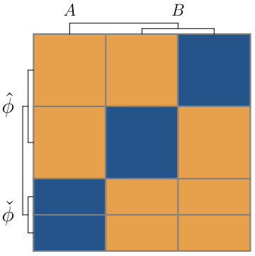

  <em>
 (Figure 4 in
    <a href="https://arxiv.org/pdf/2402.15892" target="_blank">arXiv:2402.15892</a>.)
  </em>

In the final result, Player 2 chooses all distinct allowed sequences with equal probability. Therefore, the equilibrium strategy of Player 2 is compatible with the [principle of insufficient reason](https://en.wikipedia.org/wiki/Principle_of_indifference) (or indifference) on the level of sequences, which suggests that in the absence of any reason to prefer one state over another, they (Player 1) should allocate equal probability to all possible outcomes. However, this match is accidental and does not hold in general.

### The general solution of Fisher games

Small particular cases are good for building intuition, but for the general solution, we need to be a little more creative. In the paper, I used a usual mathematical format: I proposed an ["Ansatz"](https://en.wikipedia.org/wiki/Ansatz) (an educated guess) for the general form of the solution with a few free parameters, then these parameters were set by consistency conditions, and finally, the proposed equilibrium property was proven by checking the required inequalities for Nash equilibria.

#### Intuition behind the Ansatz

This seemingly unjustified guesswork is perfectly valid in mathematics, as long as the final result is proven rigorously. But in a blog post, I might write a little more about the intuition behind the Ansatz, even if it is somewhat hand-wavy for a paper.

It seems clear that Player 2 (the chooser) will randomise between the two scenarios, but it is not guaranteed that she will choose them with equal probability. (Therefore, we keep a free parameter $P$ for this mixing parameter.)
Symmetry suggests that when a specific scenario is set, Player 2 can confuse Player 1 (the guesser) the most, by choosing uniformly from all possible sequences, i.e. including all permutations of the bits in her disposal.
Analogously, Player 1 is expected to sample uniformly from the produced sequence, to prevent Player 2 from exploiting any bias in her sampling strategy.

In simple win-lose gambles, it is advantageous to always bet on an outcome which is most probable. (For example, if we have a 70% chance of winning if we choose A and 30% if we choose B, then we should choose A (because if we ever choose B instead of A, then we decrease our chance of winning).)
Because of this simple observation, in most cases, the taken sample will provide enough evidence that tilts the odds in favour of one scenario or the other. (Because of the joint randomised permutations, the evidence is basically the number of 1-s ($\textcolor{#000000}{\blacksquare}$), $k$ observed in the sample.)
Therefore, for small enough $k$ – the number of 1-s – Player 1 is expected to guess A (because by convention the number of 1-s is less in scenario A than in B $K_A < K_B$), while for large enough $k$, she is expected to guess B.
(This does not mean, of course, that Player 1 can be sure about her guess; it only means that she is expected to make a determined choice to maximise her chance of winning if the evidence is strong enough.)

However, two questions remain: what should be the threshold values of $k$ – number of 1-s – to switch from guessing A to guessing B, and what should Player 1 do if the evidence is inconclusive, i.e. if the number of observed 1-s is exactly on the threshold?
We can keep the critical value of the number of 1-s as an additional free parameter $k^\bullet$, and by borrowing intuition from the smallest nontrivial example, assume that a randomised guess might be part of Player 1's optimal strategy.
Therefore, we can keep another free parameter $\nu$ to characterise the randomised guess if the number of 1-s takes precisely the critical value $k=k^\bullet$. 
(The probability of guessing A in this critical case is assumed to be $\nu$, while the probability of guessing B is $1-\nu$.)

In summary, there are three characteristic parameters describing the equilibrium solution of a general Fisher game $\mathfrak{Game}(N, K_A, K_B, M)$:

- $P^* \in (0,1)$, the probability of Player 2 choosing scenario A;
- $` k^* \in \{0,\dots,N \} `$, the threshold or critical value of the number of 1-s in the sample, under which Player 1 guesses scenario A and above which she guesses B;
- $\nu^* \in [0,1)$, the probability of guessing A if the number of 1-s is exactly the critical value in the sample.

#### Links for the general solution

The general (symmetric) solution for Fisher games can be found in [Section 2.4](https://arxiv.org/pdf/2402.15892#subsection.2.4), culminating in [Theorem 2.1](https://arxiv.org/pdf/2402.15892#theorem.2.1), which is proven explicitly in [Appendix A](https://arxiv.org/pdf/2402.15892#appendix.A).

#### Examples and Visualisations

Instead of explicitly spelling out the formulae for the general solution in [Theorem 2.1](https://arxiv.org/pdf/2402.15892#theorem.2.1), it might be more illustrative to show some results which are computed by it.

<table>
  <tr>
    <td align="center" width="50%">
       
      <em>
 Fig.
      <a href="https://arxiv.org/pdf/2402.15892#figure.caption.27" target="_blank">5a</a>:
 N=2, KA=2, KB=4, M=7.</em>
    </td>
    <td align="center" width="50%">
       
      <em>Fig.
      <a href="https://arxiv.org/pdf/2402.15892#figure.caption.27" target="_blank">5b</a>:
 N=3, KA=2, KB=4, M=8.</em>
    </td>
  </tr>
</table>

  <em>
 Equilibrium Strategy plots for general Fisher games
 (Figure 5 in
    <a href="https://arxiv.org/pdf/2402.15892" target="_blank">arXiv:2402.15892</a>.)
  </em>

(The cover image of this section is also a relatively large, highly symmetric equilibrium Strategy plot for $\mathfrak{Game}(N=4, K_A=4, K_B=6, M=10)$, showing an intricate fractal-like pattern.)

Further to show how the equilibrium parameters look for a gamut of larger games, see the computed results for approximately five thousand distinct Fisher games.
This is a systematic exploration of all Fisher games with 100 bits in total ($M=100$) and 4 bits to sample ($N=4$), while varying the number of 1-s in both scenarios ($K_A$ and $K_B$) from 0 to 100.

<table>
  <tr>
    <td align="center" width="30%">
      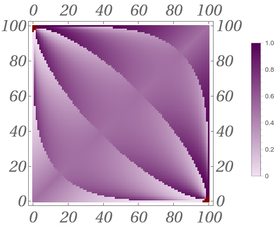 
      <em>
 P(KA, KB)
    </td>
    <td align="center" width="30%">
      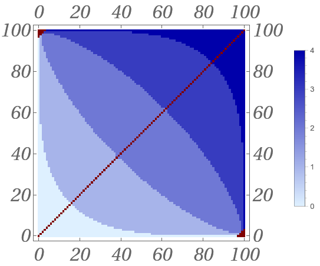 
      <em>
 k(KA, KB)
      </em>
    </td>
        <td align="center" width="30%">
      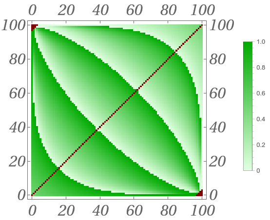 
      <em>
 nu(KA, KB)
      </em>
    </td>
  </tr>
</table>

  <em>
    <a href="https://arxiv.org/pdf/2402.15892#figure.caption.31" target="_blank">Figure 7</a>:
 Equilibrium parameters (P, k, nu) for all Fisher games with N=4, M=100.
  </em>

Besides the primary equilibrium parameters of Fisher games ($P^*, k^*, \nu^*$), I plotted the values – or winning chances – $v^*$, for the same set of Games, and a composite parameter $s^* = (k^* + \nu^*)/(N+1)$.

<table>
  <tr>
    <td align="center" width="30%">
      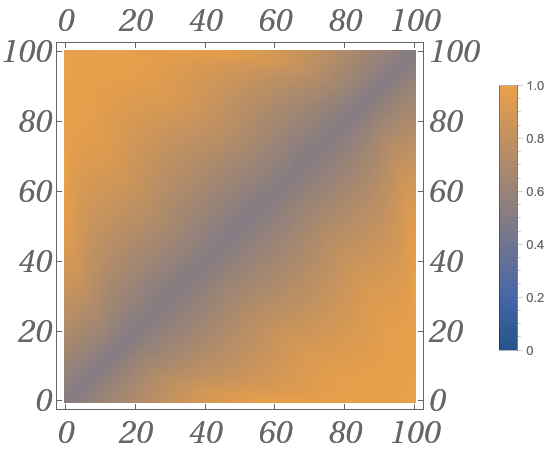 
      <em>
 v(KA, KB)
      </em>
    </td>
    <td align="center" width="30%">
      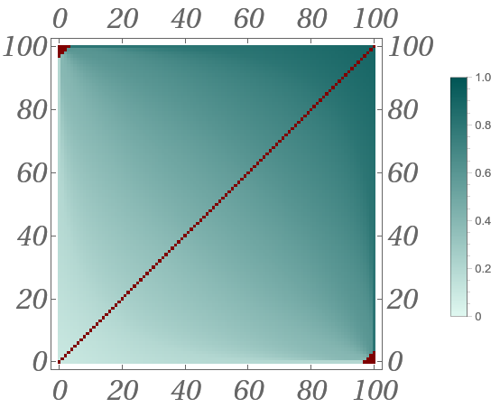 
      <em>
 s(KA, KB)
      </em>
  </tr>
</table>

  <em>
    <a href="https://arxiv.org/pdf/2402.15892#figure.caption.32" target="_blank">Figure 8</a>:
 Equilibrium derived parameters (v, s) for all Fisher games with N=4, M=100.
  </em>

The definition of $s^*$ might seem arbitrary for finite Fisher games; however, such a combination will become a proper continuous function as we take the limit in the length of the produced bit sequences ($M$), while keeping the density of 1-s in both scenarios constant.

In the paper, there are even more examples, including smaller ($N=4$, $M=10$) and larger ($N=15$,$M=100$) cases.

### Emerged Statistical concepts

I think what is remarkable is that we defined a very simple guessing game, and simply by searching for optimal strategies in it, we stumbled upon basic statistical concepts.
These concepts were not assumed or forced into the framework, but rather emerged from the structure of the Game and the players' randomised equilibrium strategies.

A few emergent concepts which might be familiar from statistics:

- **Sufficient statistics**: in principle, Player 1 was allowed to incorporate any data she collected during sampling, including the position and the order of the observed bits. However, it turned out that in this Game, there exists a symmetric equilibrium, where Player 1 can make her decision by taking into account only the total number of 1-s (regardless of their position or order). In statistics, this is called ["Sufficient statistics"](https://en.wikipedia.org/wiki/Sufficient_statistic), i.e. an aggregated summary of the collected data which is sufficient to make decisions or predictions.

- **Type I and Type II errors**: The concepts of [Type I](https://en.wikipedia.org/wiki/Type_I_and_type_II_errors#Type_I_error) ("false positive", the rejection of the null hypothesis when it is true) and [Type II](https://en.wikipedia.org/wiki/Type_I_and_type_II_errors#Type_II_error) ("false negative", the failure to reject the null hypothesis that is false) errors were central to Neyman and Pearson and are still important concepts in Hypothesis testing in "Frequentist" statistics.
The equilibrium policy in a Fisher game can be viewed as a statistical test for the hypothesis, stating that A is the correct scenario.
Remarkably, the equilibrium property of the solution implies that the total error of this – partially randomised – strategy represents a "statistical test" which has a total error probability (Type I + Type II) independent of the occurrence of the scenarios $P$, i.e. "independent of the probability law a priori".

- **Randomised sampling**: The randomisation of sampling in statistics (and particularly in Randomised Controlled Trial ([RCT](https://en.wikipedia.org/wiki/Randomized_controlled_trial)) studies) is a central concept which was present from the very early days of the discipline.
(R. A. Fisher argued for the randomised experimental design from 1923-1924.)
In the Game-theoretic framework, this emerges naturally due to the mutual randomisation of Player 1 and Player 2 in sampling and sequence selection. Viewing hypothesis testing as a Game gives a clear intuition and motivation to select our samples in an unpredictable and unbiased way.

- **Emergence of probability distributions**: Remarkably, not only were the mentioned statistical concepts not imposed on the solutions, but initially, the construction of Fisher games did not contain any chance-related procedures.
The definition of the Game is totally deterministic, therefore any internal probabilistic concept – helpful to obtian the optimal strategy – are emergent, and can be interpreted in the same way as mixed strategies in Game-theoretical equilibria: "A player's behaviour may be perceived by all the other players as the outcome of a random device, even though this is not the case."
In other words, Fisher games demonstrate that the concept of random numbers and random distributions proves to be useful in decision-making problems involving the collection and evaluation of data, even if we can't find a truly stochastic process behind the source of the data.

- * **Randomised acts**: One concept which is alien to traditional statistics is the randomisation of our guess, when we encounter a critical number of 1-s in our random sample. Statisticians have been discouraged from such unpredictable and unreplicable behaviour; however, I argue that if we take our Game seriously, randomisation not only in sampling, but sometimes in guessing, is crucial.
This can be viewed as another indication that decision-making in the face of deep uncertainty is more of an art related to actions than a purely scientific endeavour immersed in thought.

For further details and references, see [Section 2.6](https://arxiv.org/pdf/2402.15892#subsection.2.6) in the paper.

  

  <em>
    <a href="https://statisticsblog.com/2012/01/15/r-a-fisher-illustration/" target="_blank">R. A. Fisher illustration</a> by Rachelle Scarfó.
  </em>

## Bayesian games

  

  <em>
 Image source:
    <a href="https://www.montecarlosbm.com/en/casino-monaco/games/roulette-anglaise" target="_blank">Casino de Monte-Carlo</a>.
  </em>

**Double or nothing**: Now, we enter a different casino, where instead of betting simply on scenario A or B, we can place some portion of our capital on each alternative. The portion we put on the winning scenario (chosen by Player 2) will be doubled, while the portion placed on the other scenario will be lost.

Before continuing with abstract concepts, I invite you to explore your gut feelings on such betting opportunities.

Imagine that you are really in the casino, and you are assured that outcome A can happen with probability $P=70\%$ and B with probability $(1-P)=30\%$.
What portion of your initial capital would you push on A and what portion on B?
(You need to put all of your chips on some outcome.)

What if you can bet multiple times by reinvesting your current capital?
What if there are 2, 3, or 10 rounds?

Would you commit all your capital to the more probable A, and hope for a great return, but risk being bankrupt? Or would you always put half of your capital into A and the other half into B, thereby practically opting out of the gamble? (If you do equal splitting in a double-or-nothing game, you will always double half of your capital; therefore, with this hedging strategy, your amount of chips stays the same regardless of the outcome.)

Or would you put a little more portion on the more probable outcome? If so, how much more? If you are cautious, you might push only a little more than $50\%$ to A. If you are bold and brave, then maybe only a little less than all-in.

There might be no objectively good answers to this gambling dilemma, but committing around $70\%$ of your capital to A and $30\%$ to B might sound like a right balance – even if the betting lasts for numerous rounds. Does your gut agree?

  

  <em>
    <a href="https://www.freepik.com/premium-vector/casino-chips-falling-realistic-3d-gambling-poker-chips-background-poster-card-logo_19282474.htm" target="_blank">Falling casino chips</a>
  </em>

### A case for utility functions

To suggest anything useful for betting games where a portion of the player's (or gamblers) capital can be allocated, we have to talk about *utility functions*.

In some games, such as in tic-tac-toe or chess, the mapping from the outcome to some "desirability" scale is irrelevant (until we can assume that winning is more desirable than losing for both players). This is because the outcome is binary, and also because players have access to all relevant information about the state of the game and their opponent's previous moves.
An optimal tic-tac-toe game will remain the same if we double or make the price tenfold – even if the change applies only to one player (if they don't agree to cooperate and share, but let's ignore this possibility for now).

The concept of *utility* i.e. a measure of "desirability" or "value", starts to be relevant if there are more then two outcomes and some form of randomisation – either by a "device of chance" (dice, cards, roulette wheel, [Teetotum](https://en.wikipedia.org/wiki/Teetotum), [Dreidel](https://en.wikipedia.org/wiki/Dreidel) etc.) or other player's random move – plays a role in determining the final outcome.

You will act differently in a casino, when our only chance to achieve something important in the outside world is to hit the jackpot. Such a gambler might put and risk all her chips on one outcome, because her chance of winning might be slim, but playing cautiously can't bring her closer to her goals.
On the other hand, more moderate gamblers will diversify and hedge their odds, and stay away from all-in strategies.

As a concrete example, assume there are two gamblers, both with a starting capital of 100 EUR. They can play an almost fair double or nothing game with two outcomes A and B (both outcomes have a reliable $50\%$ chance). The portion put on the rolled outcome can be doubled, but in each round the casino takes $1\%$ from the doubled amount as a fee. The first player needs 198 EUR to achieve something important in the outside world, while the second player just doesn't want to lose more than 50 EUR.
The first player's best strategy is to play aggressively, and try to reach the 198 EUR target as soon as possible, so trying double on the first round by one all-in bet on either A or B.
The second player, on the other hand, can simply hedge, and if she plays in the safest way (by always equally splitting her capital), she can stay and enjoy the casino for 68 rounds before going under 50 EUR.

In this example, both gamblers preferred winning over losing, but their behaviour and strategy were very different, because they valued potential gains differently.

Formally, a utility function associates real numbers with potential outcomes, and [Expected Utility Theory](https://en.wikipedia.org/wiki/Expected_utility_hypothesis) assumes that players are maximising the expected value of their utilities. In other words, utility is by definition the quantity whose expectation players have assumed to maximise.

One might ask: are there some "natural" choices for this seemingly completely subjective quantity? I think there are at least a few good arguments that there are some reasonable default choices.

### Natural utility functions

I found two compelling arguments that could help in selecting "default" utility functions – one evolutionary and one stability argument.

In the paper [Appendix E](https://arxiv.org/pdf/2402.15892#appendix.E), this topic is dedicated.

The observation: "different utility functions can quantitatively change gamblers' behaviour" can be illustrated by plotting how a particular family of utility functions impacts the splitting ratios of gamblers as a function of seeing a specific outcome (A) with probability $P$ in a double-or-nothing gamble.

  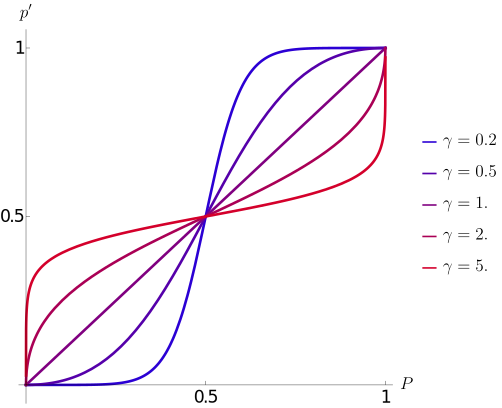

  <em>
    <a href="https://arxiv.org/pdf/2402.15892#figure.caption.181" target="_blank">Fig. 46</a>: Strategy plot for an expected utility maximising agent, which adopts isoelastic utilities.
  </em>

The particular family of utility functions, appearing to be natural or special, are the so-called isoelastic or constant relative risk aversion (CRRA) utility functions. The members of this family can be characterised by a single parameter $\gamma > 0$, associated with the gambler's so-called relative risk aversion. Intuitively, small (close to $0$) $\gamma$ values correspond to risk-neutral or brave players, while large $\gamma \gg 1$ values correspond to risk-averse or cautious players.

Formally, these utility functions – translating an amount of capital $c$ to "value" or "utility" – can be expressed as follows (however, what matters more is their impact on a gambler's splitting ratios):

$$
u_\gamma(c) = \frac{c^{1-\gamma}-1}{1-\gamma}, \quad \gamma > 0, \  \gamma \neq 1
$$

$$
u_{\gamma=1}(c) = \log(c)
$$

As it can be seen in [Figure 46](https://arxiv.org/pdf/2402.15892#figure.caption.181) risk neutral or brave players are quick to commit considerable portion of their capital when they see a winning opportunity (blueish line on the graph), while risk averse or shy players (redish lines) prefer to opt out from the gambel, and start to commit only when the winning chances are high.

A player with relative risk aversion $\gamma=1$ (purple line) has a logarithmic utility function, and commits exactly proportionally to the winning chances.

#### Gambling replicators

The evolutionary reasoning goes as follows:
Assume that there is a double-or-nothing gamble for resources, which can be directly translated to reproduction, i.e. the doubling factor in capital translates to doubling factor in population. Let's assume that seeing A has a $P=70\%$ chance, and so seeing B is $(1-P)=30\%$. We can let organisms or "replicators" have any arbitrary – but hereditary – splitting ratios $p'_i \in [0,1]$, meaning that the $i$-th species is betting her capital $p'_i$ portion to A and $(1-p'_i)$ to B.

For simplicity, let's assume that there are only two distinct replicators living and multiplying next to each other, operating with splitting ratios $p'_1$ and $p'_2$.

There are multiple ways to define evolutionary success in such a random environment, but for a very broad range of success metrics, it can be shown that after numerous rounds, there is a saddle point at $p'^*_1=P$ and $p'^*_2=P$. This essentially means that if a replicator allocates her capital in a $P:(1-P)$ proportion to A and B, then no other replicator with a different splitting ratio can outgrow her in the long run.

  

  <em>Figure 47 in 
    <a href="https://arxiv.org/pdf/2402.15892#subsubsection.E.4.1" target="_blank">Section E.4.1</a>
  </em>

This argument does not make explicit normative statements; it does not tell what a replicator "should do", but signals that replicators following exactly proportional commitment relative to the winning chances almost always outgrow other replicators, following different strategies.

The result, that in this simplified setting evolution has an answer to "how to balance boldness and caution" in gambling games, is – I think – remarkable.

We see the same splitting ratio - winning chance relation for logarithmic utility functions in [Figure 46](https://arxiv.org/pdf/2402.15892#figure.caption.181), therefore, we can make the following statement:
We can expect replicators in a population after a long evolutionary history which follow a strategy *as if* they were maximising a logarithmic utility function.

By this argument, we can avoid committing to a specific normative "should statement", but rather say that under some natural assumptions, a specific utility function can describe well the behaviour of typical agents in a population. 

#### Stability argument

Another angle of reasoning is to ask what kind of utility functions are stable after an "instrumentalisation" transformation. Instrumentalisation is the formalisation of associating instrumental utility with states or intermediate outcomes in a process.

Intermediate states or objects often don't represent for us a special value in themselves, but can be instrumental to achieve some "final goal". A tool, such as a hammer, might be practically worthless if it cannot bring us closer to our goals; for example, we have no nails at our disposal. However, if the circumstances are right, then the final goals together with the opportunities a tool represents can equip an otherwise unimportant tool with instrumental value or utility.

The same can be said about intermediate states in which an agent can find itself. These states might not hold internal value for her, but they can bring her closer to or farther from her ultimate goals. To decorate intermediate states with instrumental values or utilities, one can use the so-called [Bellman equations](https://en.wikipedia.org/wiki/Bellman_equation), which calculate how much expected terminal utility an agent can expect in an intermediate state, given that she will play or gamble optimally from there on to reach a terminal state.

Such a calculation is mostly tractable if a gambler is participating in multiple successive rounds of capital splitting gamble, and she has a specific, subjective terminal utility function associated with her capital at the final $n$-th round.
In this construction, we can "propagate back" the utility function from the final round, and, round by round, associate intermediate instrumental utility functions for non-terminal, intermediate capital values.

Without delving into the technical details, it turns out that isoelastic utility functions are stable under instrumentalisation. Furthermore, general terminal utility functions appear to converge to isoelastic instrumental utility functions upon successive application of the instrumentalisation operator.

Loosely speaking, the result suggests that "rational" players are expected to value multiplicative rewards (e.g. reinvestable capital) with isoelastic utility functions, when they are far from their "end game", i.e. when they can expect to have multiple rounds ahead of them.

I think this is a compelling argument for considering the family of constant relative risk aversion (CRRA) utility functions as "natural" or, at the very least, special.

#### Definition of the Bayesian games

After this necessary detour about utility functions, we have all the ingredients to define Bayesian games:

> [**Definition 3.1**](https://arxiv.org/pdf/2402.15892#subsection.3.2) (Bayesian game)**.** There are two players, Player 1 and Player 2.
Player 2 needs to choose between scenario A or B first and then produce a binary sequence of length $M$ containing precisely $K_A$ or $K_B$ number of $1$-s. (Without losing generality, we will assume $K_A \le K_B$.)
Following this, Player 1 (not knowing the actions of Player 2) can sample $N$ number of bits.
After observing their values, she determines what portion of her capital $p'$ she places on scenario A (while the other $1-p'$ portion is placed on scenario B).
The portion Player 1 places on the scenario, chosen by Player 2, will be doubled, while the other part of her capital will be lost.
For this specific game, we will assume that Player 1 has a logarithmic utility function and that Player 1 and Player 2 are playing a zero-sum game.
The above-defined Bayesian game will be denoted as 
$\mathfrak{BGame}(N, K_A, K_B, M)$.$♢$

The first part of the definition – including the selection of sequences and sampling – is the same as in Fisher games. The main difference is that in Bayesian games, Player 1 is not forced to definitely guess one of the scenarios, but she can continuously split her capital between the two alternatives.
Because in this case the result of the Game is not a simple win-lose outcome, but a continuous amount of gained (or lost) capital, we had to specify a utility function for Player 1, and Player 2 as well.

(The term "Bayesian game" appears in other contexts in the literature. However, the concept described here is not related to – or inspired by – [Bayesian games à la Harányi](https://en.wikipedia.org/wiki/Bayesian_game) (a common prior or distribution of "types" is an assumption that we deliberately try to avoid in this work). Alternatively, these could be called ["pre-Bayesian games"](https://web.archive.org/web/20170328225455/https://physics.ujep.cz/~jskvor/KVM/TeorieHer/shoham.pdf) or even a ["Secular Bayesian protocol"](https://www.inference.vc/the-secular-bayesian-using-belief-distributions-without-really-believing/).)

#### Equilibrium strategies of Bayesian games

**Smallest nontrivial example**:
To show the similarities and differences between Fisher games and Bayesian games, we can revisit the smallest nontrivial example, now in the continuous, Bayesian casino: $\mathfrak{BGame}(N=1, K_A=0, K_B=1, M=2)$.

Without going into the details – which by the way can be found in [Section 3.4](https://arxiv.org/pdf/2402.15892#subsection.3.4) – this Game with continuous actions can be exactly and uniquely solved. Unsurprisingly, the equilibrium sequence selection and sampling strategies are uniform randomisation among all possible sequences and indices, just like in the Fisher game. In this specific minimal game, if we see a 1 ($ \textcolor{#000000}{\blacksquare} $), Player 1 can be sure that Player 2 chose scenario B, therefore she can push all her capital to B (formally speaking, $p'^*_{k=1} = 0$). Therefore, the only two nontrivial relevant questions are: what portion of her capital should Player 1 place on A if she sees a 0 ($ \textcolor{#FFFFFF}{\blacksquare} $) and so she can't be sure, i.e. what is $p'^*_{k=0}$? And a related question: what is the probability of Player 2 choosing scenario A over scenario B, i.e. what is $P^*$?

Again, I think "common sense" suggests that scenario B should be chosen a little more often, because it contains more possible sequences and is therefore more difficult to detect. However, if Player 1 samples a 0, then she "should" bet a little more on A than B.

<table>
  <tr>
    <td align="center" width="50%">
      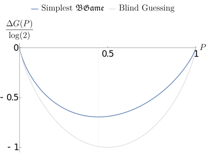 
      <em>
      <a href="https://arxiv.org/pdf/2402.15892#figure.caption.56" target="_blank">Figure 15</a>:
 Visualisation of the doubling factor difference (relative to a Sure winning game) for the smallest nontrivial example and for a Blind guessing game, as a function of Player 2's strategy of choosing A.</em>
    </td>
    <td align="center" width="45%">
       
      <em>Cheshire Cat Grin, image from
      <a href="https://jieli1985.wordpress.com/2012/03/30/quantum-cheshire-cat-even-weirder-than-schrodingers/" target="_blank">Jie Li</a>, (<a href="https://aliceinwonderland.fandom.com/wiki/Alice_in_Wonderland_(2010)" target="_blank">Alice in Wonderland</a>, 2010)
      </em>
    </td>
  </tr>
</table>

For any choosing probability $P$ of Player 2, we can find the optimal response of Player 1, and calculate the expected gain or utility she can realise. Essentially, this gain (relative to an "insider player") can be seen in the left image with the blue curve. It reaches its minimum at $P^* \approx 0.447$ (to be precise at $P^*=1/\sqrt{5}$). This is in line with the intuition that B is expected to be chosen a little more often than A ($P^* < 0.5$).

By straightforward calculations, we can also find the optimal splitting ratio for Player 1, if she sees a 0 ($ \textcolor{#FFFFFF}{\blacksquare} $) in her sample.
This is remarkably not else than the reciprocal of the [golden ratio](https://en.wikipedia.org/wiki/Golden_ratio): $p'^*_{k=0} = (\sqrt{5}-1)/2 \approx 0.618$.
Which again fulfils the expectation that Player 1 should put a little more portion of her capital to A than to B, if she sees a 0 in her sample (because even if she expects A to be chosen less often, the observational data of seeing a 0 shifts her beliefs enough to get $p'^*_{k=0} > 0.5$).

**Solution of the general Bayesian game**:
Remarkably, in the Game-theoretic solution of Bayesian games, the emergent formula for the splitting ratios $p'$ earily resembles the famous Bayes rule, justifying the name of this family of continuous games. 

$$
p'_k(P) = \frac{P \ p_k(A)}{P \ p_k(A) + (1-P) \ p_k(B)}
$$

Where $p_k(A)$ and $p_k(B)$ are internal variables, which can be associated with the probabilities of seeing $k$ number of 1-s in the sample if scenario A or B were chosen. In equilibrium, Player 1 and Player 2 are choosing/sampling uniformly from all possible sequences and indices (which allows us to express $p_k(A)$ in terms of the [hypergeometric distribution](https://en.wikipedia.org/wiki/Hypergeometric_distribution)).

  

  <em>
    <a href="https://en.wikipedia.org/wiki/Bayesian_inference_in_marketing#/media/File:Bayes'_Theorem_MMB_01.jpg" target="_blank">Bayes' theorem</a>
 spelt out in blue neon at the offices of Autonomy in Cambridge.
 Captured by
    <a href="https://www.flickr.com/photos/mattbuck007/3676624894/in/photostream/" target="_blank">Matt Buck</a>.
  </em>

However, while Bayes' rule remains silent about the "prior" and focuses only on how to update our beliefs given some evidence, in Bayesian games, the "prior" $P^*$ is an emergent part of the equilibrium solution.
Because of the "most natural" logarithmic utility function, Shannon entropy, and further information-theoretic concepts emerge naturally. In this language, the Bayesian game construction selects an equilibrium $P^*$ value (a would-be prior in the Bayesian framework), by which the conditional entropy of model labels (scenarios A or B) given the sampled data is maximised. (See the remarks in [Section 3.6](https://arxiv.org/pdf/2402.15892#subsection.3.6) for more details on these.)

The general solution for Bayesian games is spelt out in [Theorem 3.2](https://arxiv.org/pdf/2402.15892#theorem.3.2) and proven in [Appendix B](https://arxiv.org/pdf/2402.15892#appendix.B).

#### Examples and Visualisations

As images speak more and look better, especially in a blog post. Let the solutions of an array of Bayesian games speak for themselves.

<table>
  <tr>
    <td align="center" width="30%">
       
      <em>
 P(KA, KB)
    </td>
    <td align="center" width="30%">
      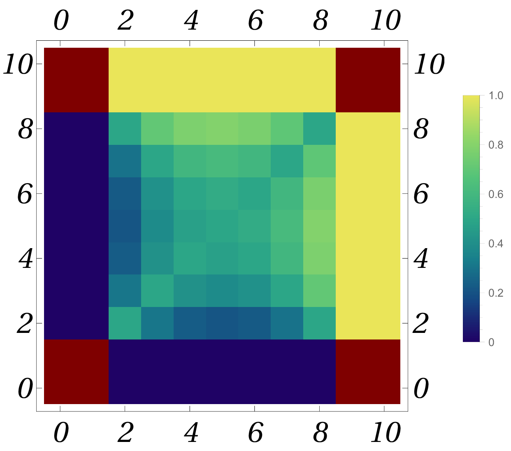 
      <em>
 p'_2(KA, KB)
      </em>
    </td>
        <td align="center" width="30%">
      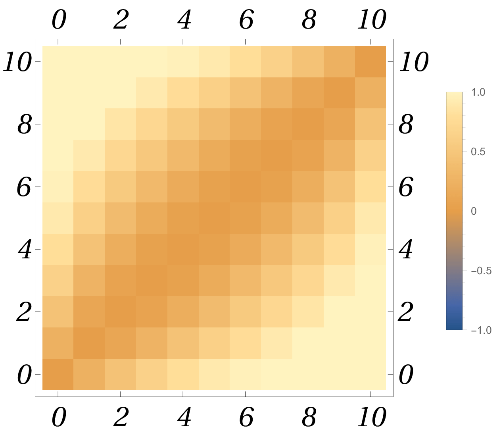 
      <em>
 G(KA, KB)
      </em>
    </td>
  </tr>
</table>

  <em>
    <a href="https://arxiv.org/pdf/2402.15892#figure.caption.72" target="_blank">Figure 17</a>:
 Equilibrium parameters (P, p'_2, G) for all Bayesian games with N=4, M=10.
  </em>

<table>
  <tr>
    <td align="center" width="20%">
       
      <em>
 p'(KA, KB) for k=0
    </td>
    <td align="center" width="20%">
       
      <em>
 p'(KA, KB) for k=1
      </em>
    </td>
        <td align="center" width="20%">
       
      <em>
 p'(KA, KB) for k=2
      </em>
    </td>
    <td align="center" width="20%">
       
      <em>
 p'(KA, KB) for k=3
    </td>
    <td align="center" width="20%">
       
      <em>
 p'(KA, KB) for k=4
    </td>
  </tr>
</table>

  <em>
 Figure 18:
 Equilibrium splitting ratios p' for k=0, 1, 2, 3, 4 for all Bayesian games with N=4, M=10.
  </em>

<table>
  <tr>
    <td align="center" width="30%">
      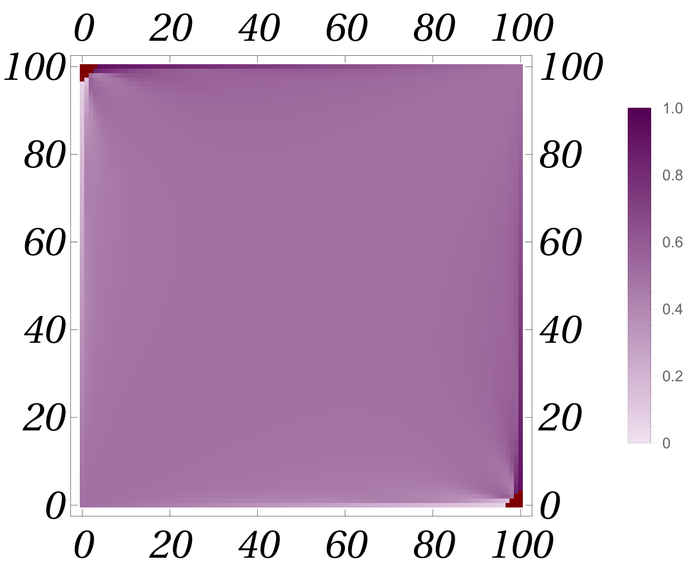 
      <em>
 P(KA, KB)
    </td>
    <td align="center" width="30%">
       
      <em>
 k(KA, KB)
      </em>
    </td>
        <td align="center" width="30%">
       
      <em>
 nu(KA, KB)
      </em>
    </td>
  </tr>
</table>

  <em>
    <a href="https://arxiv.org/pdf/2402.15892#figure.caption.74" target="_blank">Figure 19</a>:
 Equilibrium parameters (P, p'_2, G) for all Bayesian games with N=4, M=100.
  </em>

### Emerged Bayesian concepts

Again, just like in Fisher games, several basic concepts of Bayesian statistics emerge naturally in Bayesian games, without being imposed or assumed.

- **Bayes rule**: The optimal splitting ratios are calculable by a formula which is structurally identical to Bayes rule. Further, these would be the splitting ratios that the [Kelly criterion](https://www.princeton.edu/~wbialek/rome/refs/kelly_56.pdf) would suggest for a gambler who would believe that scenario A appears with the updated "posterior" probability after observing the data.

- **Exchangeability**: Because of the joint randomisation of Player 1 and Player 2 of sequence selection and sampling, the order of observed bits in the sample is irrelevant. This gives rise to an effective "exchangeability" property, which is central to Bayesian statistics (making, for example, [de Finetti's representation theorem](https://en.wikipedia.org/wiki/De_Finetti%27s_theorem) valid).

- **Shannon entropy and information theoretic concepts**: Because of the logarithmic utility function, [Shannon entropy](https://en.wikipedia.org/wiki/Entropy_(information_theory)) and further information-theoretic concepts emerge naturally. The equilibrium "prior" $P^*$ can be interpreted as the value which maximises the conditional entropy of model labels (scenarios A or B) given the sampled data.
I want to emphasise that assuming a logarithmic utility function was not a reversal-engineering step to impose information-theoretic concepts. An evolutionary and a stability argument point to this utility function; therefore, it can be expected that concepts related to it will be important for organisms with a long evolutionary history.

- **"Objective" priors** (also known as ["Uninformative" priors](https://en.wikipedia.org/wiki/Prior_probability#Uninformative_priors)):
are important parts of non-fully subjective Bayesian statistics. Besides Bayes' rule, which describes (or prescribes) how to update beliefs given some new data (or evidence), many additional principles were suggested to come up with a "default" or "objective" prior distribution in the absence of "well-founded" subjective beliefs.
(Maximum entropy priors, Jeffreys priors, Transformation groups priors, etc.)
The so-called [Reference priors](https://arxiv.org/pdf/0904.0156), introduced by José M. Bernardo and James O. Berger, are formally the closest (but not the same) concept to the emergent prior $P^*$ in Bayesian games. (One main difference being that Reference priors are maximising the [mutual information](https://en.wikipedia.org/wiki/Mutual_information) between parameters and data, while in Bayesian games the emergent prior maximises the [conditional entropy](https://en.wikipedia.org/wiki/Conditional_entropy) of model labels given the data.)

- **Emergence of probability distributions**: The definition of Bayesian games was deterministic, just like Fisher games. Still, randomised strategies in sampling (and sequence selection) and internal probabilistic concepts emerged naturally, which can be interpreted in the same way as mixed strategies in Game-theoretical equilibria.
Remarkably, the continuous splitting ratios $p'^*_k$ take exact values, and because of the concavity of the utility function, there is no randomisation in determining the splitting ratios (after the randomised sampling).

  

  <em>
 Bayes’ theorem by
    <a href="https://www.3blue1brown.com/lessons/bayes-theorem" target="_blank">3Blue1Brown</a>.
  </em>

### Binomial versions of Fisher and Bayesian games

I think it is intuitively clear what we can expect in such Games if we allow longer and longer bit sequences ($M \to \infty$), while keeping the density of 1-s in both scenarios constant (i.e. $K_A/M \to x_A$ and $K_B/M \to x_B$).

If we were to approach the problem from a standard theoretical statistical angle, this construction would be easier to start with. One does not need to bother with allowed intervals of the number of sampled 1-s, the sampling probabilities are easier to get. (In scenraio A the seeing $k$ number of 1-s in $N$ samples is simply $x_A^k$ times $(1-x_A)^{N-k}$ times the number of [combination](https://en.wikipedia.org/wiki/Combination) of exactly $k$ 1-s in $N$ bits, resulting a [Binomial distribution](https://en.wikipedia.org/wiki/Binomial_distribution) for $k$. The same argument goes for scenario B.)

However, by starting with finite Games in sampling and sequence size, we were able to demonstrate how statistical concepts and the notion of probability distributions emerge naturally from such deterministic setups. More specifically, we did not need to assume that a stochastic process generated the observable bit sequences; rather, the equilibrium assumption led us to strategies that could be interpreted *as if* the sequences were generated by random processes.

If we assume that the length of the bit sequences from which Player 1 can sample is infinite, then the sampling/sequence selecting parts of the strategies go through a combinatorial explosion and are not tractable anymore. Still, by first defining and understanding the finite cases, we can approach such idealised problems as limits of finite Games.

Because the intuitive meaning of limiting values is probably clear to most readers, while the technical derivation and proofs are somewhat technical, from now on, the results will be demonstrated without colourful plots, and I will write about only a few notable surprises after the images.

(Binomial games are discussed in [Section 4.1](https://arxiv.org/pdf/2402.15892#subsection.4.1), and the main theorems are proven in [Appendix C](https://arxiv.org/pdf/2402.15892#appendix.C).)

<table>
  <tr>
    <td align="center" width="50%">
       
      <em>
 N=1
      </em>
    </td>
    <td align="center" width="50%">
       
      <em>
 N=2
      </em>
    </td>
  </tr>
</table>

  <em>
    <a href="https://arxiv.org/pdf/2402.15892#figure.caption.79" target="_blank">Figure 23</a>:
 P(xA, xB ) for Binomial Fisher games
  </em>

<table>
  <tr>
    <td align="center" width="50%">
       
      <em>
 N=1
      </em>
    </td>
    <td align="center" width="50%">
       
      <em>
 N=2
      </em>
    </td>
  </tr>
</table>

  <em>
    <a href="https://arxiv.org/pdf/2402.15892#figure.caption.82" target="_blank">Figure 25</a>:
 s(xA, xB ) for Binomial Fisher games
  </em>

<table>
  <tr>
    <td align="center" width="50%">
       
      <em>
 N=1
      </em>
    </td>
    <td align="center" width="50%">
       
      <em>
 N=2
      </em>
    </td>
  </tr>
</table>

  <em>
    <a href="https://arxiv.org/pdf/2402.15892#figure.caption.85" target="_blank">Figure 27</a>:
 P(xA, xB ) for Binomial Bayesian games
  </em>

<table>
  <tr>
    <td align="center" width="50%">
       
      <em>
 k=0
      </em>
    </td>
    <td align="center" width="50%">
       
      <em>
 k=1
      </em>
    </td>
  </tr>
</table>

  <em>
    <a href="https://arxiv.org/pdf/2402.15892#figure.caption.88" target="_blank">Figure 29</a>:
 p'(xA, xB ) for Binomial Bayesian games with N=1 for different k values.
  </em>

<table>
  <tr>
    <td align="center" width="30%">
       
      <em>
 k=0
      </em>
    </td>
    <td align="center" width="30%">
       
      <em>
 k=1
      </em>
    </td>
        <td align="center" width="30%">
       
      <em>
 k=2
      </em>
    </td>
  </tr>
</table>

  <em>
    <a href="https://arxiv.org/pdf/2402.15892#figure.caption.89" target="_blank">Figure 30</a>:
 p'(xA, xB ) for Binomial Bayesian games with N=2 for different k values.
  </em>

(For further plotted examples, see [Section 4.2](https://arxiv.org/pdf/2402.15892#subsection.4.2) in the paper.)

The strangest pattern appears for Binomial Fisher games, especially in the first purple plots, which depict the equilibrium choosing probabilities $P^*(x_A,x_B)$ and may look a little concerning.

Seeing discontinuities or scars on the plot, rather than a smooth (or at least continuous) dependence on the continuous density parameters $x_A$ and $x_B$, might be unexpected and can be viewed as a pathology.
However, Binomial Fisher games, on Player 1's side behave nicely, and the previously constructed composite $s^*=(k^*+\nu^*)/(N+1)$ variable depends continuously on $x_A$ and $x_B$.

If we recall that these simple Games are supposed to be prototypes for decision-making problems in the face of uncertainty, then we can take the pragmatic position that until the equilibrium strategies for Player 1 appear to be reasonable, pathologies on Player 2's side can be accepted and swept under the rug.
(In general, various strange and counter-intuitive phenomena can emerge with the parameters characterising the "other side's" equilibrium strategies – which are peculiar and interesting formally – but need not concern us until the strategy for Player 1 remains regular.)

As an additional minor comment, it is interesting to note that in Binomial Bayesian games the emergent "prior" $P^*(x_A,x_B)$ remains very close to $50\%$ for most parameter values (deviating typically only $1-2\%$).
(And both the prior and the splitting ratios are nice, smooth functions of the continuous $x_A$ and $x_B$ parameters.)

### The asymptotic regime (when data goes to infinity)

The case, where the sample size goes to infinity, i.e., Player 1 has more and more data to make her decision, is both an interesting and boring limiting case.
Interesting, because the asymptotic behaviour of various equilibrium parameters is a delicate mathematical matter, and boring, because as we have more and more data, even simplistic heuristics can provide good answers for guessing or betting on the correct scenario. (If Player 1 can collect an increasing amount of relevant data, then she can be almost sure about the scenario, i.e. in this limit, the data speaks so loudly that initial context or beliefs become irrelevant.)

Mathematically, this limiting case was the most challenging, and in the end, only a convincing conjectured formula has been derived. Half-jokingly, we could say, that this is another example of [Fredkin's paradox](https://en.wikipedia.org/wiki/Fredkin%27s_paradox): "The more equally attractive two alternatives seem, the harder it can be to choose between them [...]" (Because as the amount of observed data goes to infinity, in practice any heuristic assuming a $P\in(0,1)$ would work well. Choosing the optimal $P^*$ proved to be hard, and at the same time not that important.)
Nevertheless, for those who like analytical delicacies, this problem can present a set of challenges, and a rigorous proof might involve fine inequalities, asymptotic analysis, special functions, and other delicate mathematical tools.
(This topic is discussed in [Section 4.3](https://arxiv.org/pdf/2402.15892#subsection.4.3) and calculations presented in [Appendix D](https://arxiv.org/pdf/2402.15892#appendix.D) of the paper.)

#### Binomial Fisher games in the asymptotic regime

In case of Binomial Fisher games, the composite variable $s^*_N(x_A,x_B)$ characterising Player 1's strategy converges to a well-defined limit:

  

  <em>
    <a href="https://arxiv.org/pdf/2402.15892#figure.caption.96" target="_blank">Figure 32</a>:
 Binomial Fisher policy limit. Contour lines show 1% difference.
  </em>

Remarkably, we would obtain the same limiting decision rule and boundary if we applied the [maximum likelihood principle](https://en.wikipedia.org/wiki/Maximum_likelihood_estimation), i.e., choose scenario A if the likelihood of observing the sampled data given scenario A is higher than that of scenario B, and vice versa.

While $P^*_N(x_A,x_B)$, describing Player 2's equilibrium choosing probability, is cut by more and more scars, and does not converge, but rather takes values between two limiting upper and lower envelopes. (Conjecture for the limiting upper and lower bounds can be found in [Conjecture 4.1](https://arxiv.org/pdf/2402.15892#conjecture.4.1) of the paper.)

#### Binomial Bayesian games in the asymptotic regime

The situation is somewhat different in Binomial Bayesian games.
Although the equilibrium prior $P^*_N(x_A,x_B)$ is smooth for any finite $N\in \mathbb{N}$, numerical evidence and formal derivation suggest that a finite oscillation remains even in the limit $N \to \infty$.

(To gather reliable numerical evidence, controlled and effective numerical methods had to be applied to the problem. Most of the results have been obtained using Newton's method, extended by an exact error bound calculation made possible by a global upper bound of a relevant second derivative. (For details see the paragraph **Controlled Newton–Raphson method** in [Section 3.7.1](https://arxiv.org/pdf/2402.15892#subsubsection.3.7.1)))

To show the raw numerical evidence, see the following plot, where several equilibrium $P^*_N(x_A,x_B)$ values are plotted for large $N$ sampling numbers (from 1 to 300 with stepsize $\Delta N =5$).

  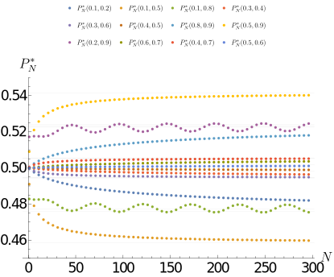

  <em>
    <a href="https://arxiv.org/pdf/2402.15892#figure.caption.103" target="_blank">Figure 34</a>: Numerically calculated equilibrium prior values (and gridlines at the limit prior approximations).
  </em>

And then to compare the results of a rather complicated and not completely rigorously derived formula for the asymptotic limit, see the plot, where both the numerical results and the theoretical predictions (or rather their conjectured form) are shown in one plot.

  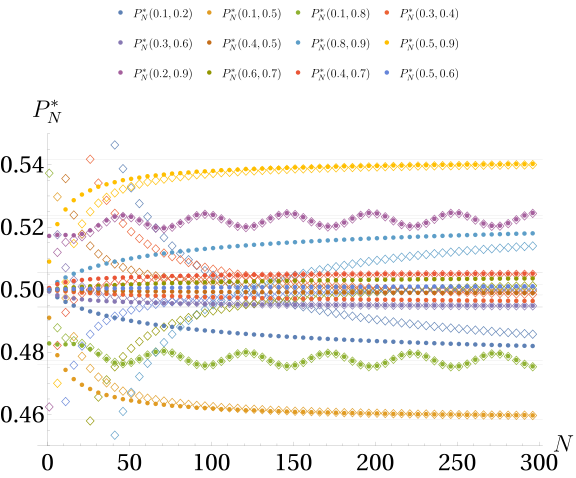

  <em>
    <a href="https://arxiv.org/pdf/2402.15892#figure.caption.105" target="_blank">Figure 35</a>: Numerically calculated equilibrium prior values marked by coloured dots (●), and the values of first-order asymptotics, marked by coloured diamonds (◇).
  </em>

For the exact conjectured form of the asymptotic formula, see [Conjecture 4.3](https://arxiv.org/pdf/2402.15892#conjecture.4.3) in the paper.
The connection between the numerically calculated values and the asymptotic formula is convincingly demonstrated by the above plot. The diamonds (◇) are almost always "capturing" the corresponding coloured dots (●), i.e. the asymptotic expression is getting closer to the numerical values as $N$ increases.

Although finite oscillations appear to remain in the asymptotic regime, a simplified approximate formula for the limiting prior might be worth mentioning. See below the contour plot of this "good approximation" of the $P^*_N(x_A,x_B)$ equilibrium prior values for large $N$:

  

  <em>
    <a href="https://arxiv.org/pdf/2402.15892#figure.caption.101" target="_blank">Figure 33</a>: Binomial Bayesian limiting prior approximation. Contour lines show 1% difference.
  </em>

I think that these analytical and numerical results demonstrate that the construction makes sense and gives reasonable suggestions even in the $N \to \infty$ limit. Well-behaved asymptotic limits are important and reassuring, because this can demonstrate that equilibrium strategies in the limit correspond to classical "frequentist" and Bayesian statistical approaches.

### General Statistical Games

In a sense, this is the point where one of the main promises of the paper and the abstract can be fulfilled.
A unification of Games, resembling classical or "frequentist" statistics in strategy, and continuous capital splitting Games – where Bayes' rule naturally emerges together with information-theoretic concepts – is possible through the deformation of the adopted utility function.

#### Why "Frequentists" and "Bayesians" disagree?

There are two partly competing, partly complementary schools of thought in statistics: the "Frequentists" and the "Bayesians".
I won't be able to summarise all the main points between these two approaches, but from a Game-theoretic point of view, it looks possible that a difference in values plays an important role in the conflict.

  

  <em>Cartoon borrowed from
      <a href="https://agostontorok.github.io/2017/03/26/bayes_vs_frequentist/" target="_blank">Ágoston Török</a>, (sketched by <a href="https://scholar.google.com/citations?user=x3WzPt4AAAAJ" target="_blank">Borbála Tölgyesi</a>)
      </em>

In a nutshell, "Frequentist" statistics frequently asks questions like: "Does the result of a designed experiment allow us to hold a given (null) hypothesis, or are we forced to reject it?".
While the "Bayesian" approach usually involves a – hopefully exhaustive – set of hypotheses outlined in advance, we make a priori assumptions about their plausibility, and then use the collected data as evidence to update our beliefs about the plausibility of the various hypotheses.

The results in Statistical Games suggest that such different approaches might be fit for different environments. Where data is abundant and the stakes are not too high, simple, binary decisions might work better; therefore, "Frequentist" approaches might be more suitable. In situations where data is scarce and/or the stakes are high, prior information becomes more important, and continuous hedging is safer; therefore, "Bayesian" approaches might be more suitable.

  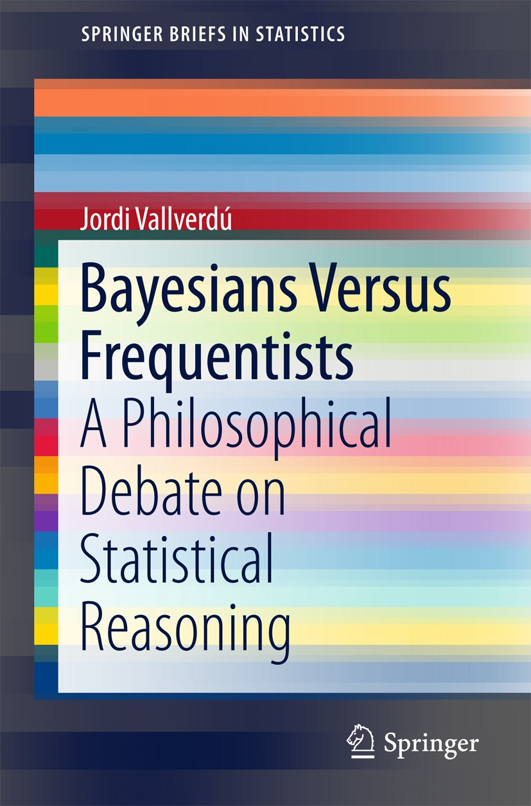

  <em>
      <a href="https://link.springer.com/book/10.1007/978-3-662-48638-2" target="_blank">Bayesians Versus Frequentists </a>
      </em>

The "Frequentist" and "Bayesian" debates also have a more philosophical angle. The "Frequentists" approach is closer to ["falsificationism"](https://en.wikipedia.org/wiki/Falsifiability#Naive_falsificationism) or to "negative theology" (e.g. [*via negativa*](https://kleong54.medium.com/the-power-of-negative-theology-a-path-to-interfaith-unity-cd9c3c6a1fb2) or [*Neti Neti*](https://en.wikipedia.org/wiki/Neti_neti)), not committing to a particular model or family of models about reality, but giving a veto power to data to reject our null (or dull) hypotheses about Nature.
Because of that, it can happen that a devoted "Frequentist" concludes that all her original hypotheses have to be rejected in the light of the obtained data. I think this is perfectly valid – and, to my taste, a wise – position, if we consider our knowledge and what we can ultimately know about reality. However, if one needs to make decisions and act based on partial information, then the luxury of pondering and being unsure is gone, and we must select an action even if we suspect that our model of reality is incomplete or even wrong.

> All models are wrong, but some are useful. – [George E. P. Box](https://en.wikipedia.org/wiki/All_models_are_wrong)

On the other hand, "Bayesian" philosophy commits itself to quantifying our uncertainty about the plausibility of models by probability distributions. If there were no other way to formalise uncertainty, then, perhaps, this would be the only way to go. However, the "Frequentist" critique, that models or hypotheses do not possess well-defined probabilities, might be taken seriously, and even some Bayesians admit that "prior" probabilities and "likelihoods" (or parameter-dependent chances appearing in stochastic models) are somewhat different.

(There are further disagreements, including the [interpretation of probability](https://plato.stanford.edu/entries/probability-interpret/), the role of subjectivity and objectivity in statistics, etc. Which I might not be able to untangle in this blog post.)

#### Unification via Games and utility functions

In the Game-theoretic framework, we got "equilibrium priors", but these are volatile – one might say ghostly or mystical – and contingent on the goals, the fears and wishes of the Agent. (Some authors, while [describing](https://arxiv.org/abs/1207.4147) essentially the same concepts, are reluctant to introduce variables corresponding to them. I chose to expose such fictional parameters because I think that humans have innate intuitions in them shaped by a long evolutionary history of strategic decision making and managing uncertainty.) It is indeed a different kind of probability than we usually associate with an ideal coin or dice, which is assumed not to care about our aims before or during a roll. (In fact, I claim that almost all probabilistic concepts can be interpreted by the volatile fictional concept, but past experiences and collected data can sufficiently decrease its dependence on subjective factors, making some processes more and more "objectively" characterisable by the concept of blind chance.)

So far, we treated Fisher and Bayesian games in parallel, but separately.
A unification is achievable if we generalise the "most natural" logarithmic utility function to the whole family of "natural" utility functions introduced earlier.

> **(Simplified) [Definition 5.1](https://arxiv.org/pdf/2402.15892#definition.5.1)** (Statistical game)
Loosely speaking, a Statistical game is the same as the continuous Bayesian game $\mathfrak{BGame}(N, K_A , K_B , M )$, except that the utility function is an isoelastic utility function:
>$$
u_\gamma (c) = \begin{cases}
\frac{c^{1-\gamma} - 1}{1 - \gamma}, & \text{if } \gamma \neq 1, \\
\ln(c), & \text{if } \gamma = 1.
\end{cases}
>$$
>with relative risk aversion parameter $\gamma > 0$.
The above-defined Statistical Game will be denoted as
$\mathfrak{SGame}(N, K_A , K_B , M, γ)$.

  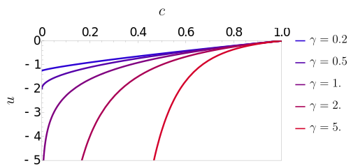

  <em>
 Figure 45: Isoelastic utility functions, for several relative risk aversion parameters.
  </em>

The visualised isoelastic utility functions for various relative risk aversion parameters $\gamma$ are shown in the plot above. For $0 < \gamma < 1$, an Agent is not feeling infinitely bad about losing all her capital, while for $\gamma \ge 1$, there is no worse than losing everything. In the $\gamma \to 0$ limit, the utility function becomes linear, representing a risk-neutral Agent, while at $\gamma = 1$ we get back the logarithmic utility function.

The main advantage of such a one-parameter generalisation of continuous splitting Games is that both Fisher and Bayesian games appear as special cases:

$$
\lim_{\gamma \to 0} \mathfrak{SGame}(N, K_A , K_B , M, \gamma) \leftrightsquigarrow \mathfrak{Game}(N, K_A , K_B , M)
$$

$$
\lim_{\gamma \to 1} \mathfrak{SGame}(N, K_A , K_B , M, \gamma) \leftrightsquigarrow \mathfrak{BGame}(N, K_A , K_B , M)
$$

The identification with Fisher games, of course, needs to be made more precise, but the correspondence will be made explicit soon.

We use once more the **smallest nontrivial example**, i.e. $\mathfrak{SGame}(1,0,1,2,\gamma)$ to build intuition.

In general, the optimal splitting ratios $p'^*_{\gamma,k}$ do not follow Bayes' rule anymore, but a deformed form of it:

$$
p'_{\gamma,k}(P) = \frac{( P \ p_k(A))^{1/\gamma}}{( P \ p_k(A))^{1/\gamma} + ( (1-P) \ p_k(B))^{1/\gamma}}
$$

And in general, $P^*_\gamma$ is not minimising the conditional Shannon entropy, but it can be found by searching for the value that minimises the expected utility of Player 1.

For the **smallest nontrivial example**, $\mathfrak{SGame}(1,0,1,2,\gamma)$, the expected utility relative to an "insider player" looks the following for $0 < \gamma \le 1$ values:

  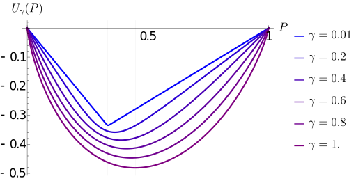

  <em>
 Figure 37: Expected utility for the smallest nontrivial Statistical game (N = 1, KA = 0, KB = 1, M = 2) as a function of P for different relative risk aversion values.
  </em>

The minimum position of the expected utility curve shifts from $P^*_{\gamma \to 0} = 1/3$ (the Fisher game solution) to $P^*_{\gamma = 1} = 1/\sqrt{5} \approx 0.447$ (the Bayesian game solution) as we tune the relative risk aversion parameter $\gamma$ from 0 to 1.

A similar shift can be seen in the splitting ratios as well (see [Figure 38](https://arxiv.org/pdf/2402.15892#figure.caption.113) in the paper for the smallest nontrivial example).

For illustrative purposes, a slightly larger example is shown below:

  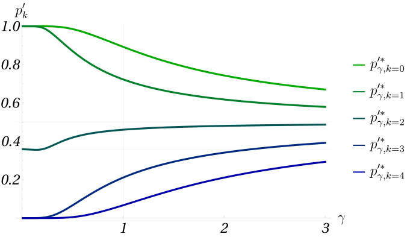

  <em>
    <a href="https://arxiv.org/pdf/2402.15892#figure.caption.114" target="_blank">Figure 39</a>: Splitting strategies for the Statistical game (N = 4, KA = 5, KB = 8, M = 14) as a function of relative risk aversion parameter.
  </em>

We can observe that as the relative risk aversion parameter $\gamma$ approaches 0, almost all splitting ratios $p'^*_{\gamma,k}$ approach either 0 or 1, and only one in-between line takes a non-extreme value.
This pattern remains valid in general and provides an intuition on how discrete Fisher games and continuous Statistical games can be linked.

It can be rigorously proven – and the proof can be fond in [Appendix F](https://arxiv.org/pdf/2402.15892#appendix.F) – that in the $\gamma \to 0$ limit the optimal splitting ratio for a critical $k^*$ value (which is the critical number of 1-s for the corresponding Fisher game) $p'^*_{\gamma,k^*}$ converges to nothing else than the equilibrium probability of guessing A, $\nu^*$, in the corresponding Fisher game.
Formally:

$$
\lim_{\gamma \to 0} p'^*_{\gamma,k^*} = \nu^*
$$

(See the precise statement in [Theorem 5.2](https://arxiv.org/pdf/2402.15892#theorem.5.2).)

This result accomplishes several important things: 
- It justifies the use of symmetric equilibria in Fisher games, because for all $\gamma > 0$ the equilibrium solutions are unique (and uniformly randomised) while "degeneracies" (which is a bit unfortunate [technical term](https://www.cs.cmu.edu/~sandholm/cs15-892F13/algorithmic-game-theory.pdf)) appear only in the discrete Fisher games.
- It also gives rigidity to the construction of Fisher games; a randomised policy is needed in the critical case, to join Fisher games with always deterministic splitting of Statistical games.
- Finally together with the matching of priors ($\lim_{\gamma \to 0} P^*_\gamma = P^*_{\text{Fisher}}$, $\lim_{\gamma \to 1} P^*_\gamma = P^*_{\text{Bayes}}$) it gives a unifying framework for both Fisher and Bayesian games.

## Call for collaboration

<!--

Many developments have occurred since Statistical Games were made public. Relevant references are collected on the project's [GitHub page](https://github.com/Konczer/UncertaintyTheory/tree/main/StatisticalGames).

- 

The outlined program of reformulating statistics – and possibly probability theory – in a Game-theoretic framework is far from being complete.
Further developments have happened since I made Statistical Games public in February 2024 (I collect additional materials, e.g. software, talks, etc., on the project's GitHub page). A related arXiv paper is now out *Non-Cooperative Games with Uncertainty*, addressing the problem of multiple Agents simultaneously interacting with an uncertain environment and each other.

If you found this read and this playful approach to statistics interesting, then consider engaging with the project. There are multiple ways to get involved:

- Relatively low engagement options:
  - Give feedback or ask questions publicly on [alphAxiv](https://www.alphaxiv.org/pdf/2402.15892);
  - Reach out to me (you can find contact details on the [paper](https://www.arxiv.org/pdf/2402.15892) as well as on my [homepage](https://konczer.github.io/)), and give feedback, ask questions and/or let's discuss collaboration opportunities privately;
  - Reshare, repost, repurpose the material. All materials are free to use under [Attribution 4.0 International (CC BY 4.0)](https://creativecommons.org/licenses/by/4.0/) Creative Commons license. I am much more interested in creating and spreading useful and high-quality content than getting credit, but I am grateful for every citation, and I try to make citations easy.
- Academic collaboration options:
  - I am happy to talk about the topic at seminars, workshops, conferences, both online and offline. Let me know if some aspects of this line of research align with your group's or department's interests. Feel free to contact or invite me!
  - Cite my work. The essential concepts in this blogpost can be found in two arXiv papers, and one (unfinished, live) essay:
    - [Statistical Games](https://www.arxiv.org/abs/2402.15892)
    - [Non-Cooperative Games with Uncertainty](https://arxiv.org/abs/2503.01889)
    - [Essay on Uncertainty](https://github.com/Konczer/UncertaintyTheory/blob/main/Essay/pdf/EssayOnUncertainty.pdf)
  - For Mathematicians:
    - Completing proofs, inequalities, asymptotic analysis, etc.
  - Statisticians:
    - Finding problems which can be effectively addressed by this approach
  - For Computer Scientists
    - Blahut–Arimoto algorithm
  - Machine Learning researchers:
    - Active learning under uncertainty
    - Reinforcement learning
       - Acquisition functions (exploration vs. exploitation trade-off)
       - A framework for Multi-Agent Reinforcement Learning under uncertainty
  - Physicists
    - If you are interested in an alternative foundation for statistical physics
    - Quantum metrology 
  - For Economists
    - A formalisation of deep or Knightian uncertainty
  - Cognitive Scientists
    - Modelling decision making under uncertainty
  - Philosophers:
    - Metaphysics of probability and uncertainty
  - Interdisciplinary research groups:
    - [Santa Fe Institute](https://www.santafe.edu/) 
- Contributing by code:
- Applied, industrial, business collaboration options:
  - AI alignment and safety
  - Climate policy and risk management
  - Resource, i.e. Hydrogen or mineral discovery
  - Finance and automated trading

  -->